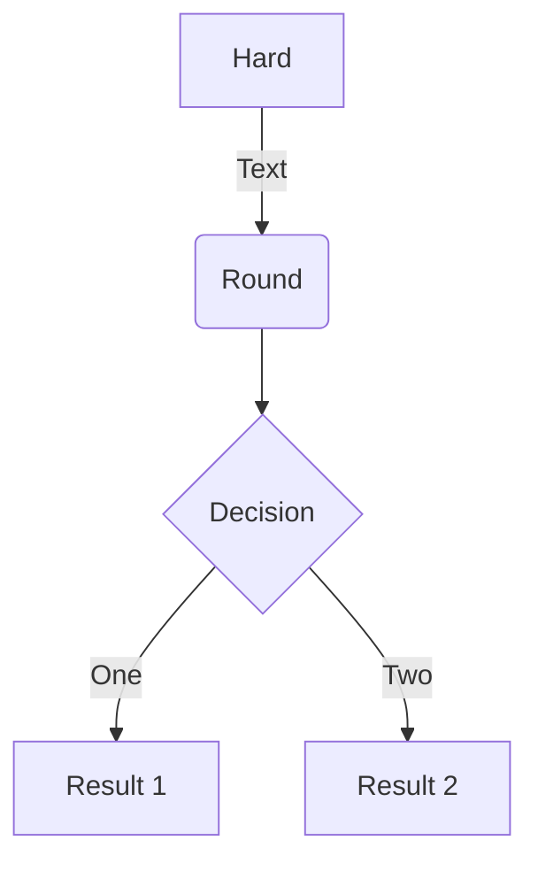

# Adding support for additional software

## Easyconfigs vs easyblocks

## Writing easyconfig files

```python linenums="1"
name = 'example'
version = '1.2.3'

toolchain = {'name': 'foss', 'version': '2019b'}
```



### Mandatory parameters

#### Software name & version

#### Homepage and description

#### Toolchain

### Commonly used parameters

#### Easyblock

generic vs software-specific

common generic easyblocks

#### Sources

#### Dependencies

#### Command options

#### Sanity check

#### Module class

### Custom parameters

`eb -a --easyblock`

## Implementing easyblocks

(out of scope)

## Hands-on exercises

***Exercise 4.1**** - Searching easyconfigs*

See if EasyBuild provides any easyconfig files for TensorFlow 2.2.0.

??? success "(click to show solution)"
    ```shell
    eb --search TensorFlow-2.2.0
    ```
