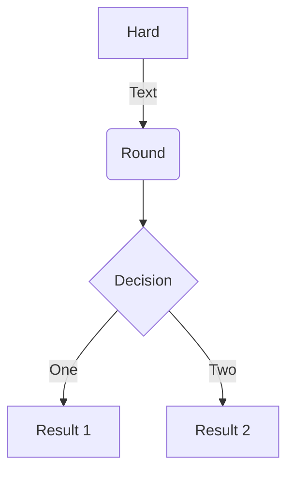

```python linenums="1"
name = 'example'
version = '1.2.3'

toolchain = {'name': 'foss', 'version': '2019b'}
```


```mermaid
graph TD
    A[Hard] -->|Text| B(Round)
    B --> C{Decision}
    C -->|One| D[Result 1]
    C -->|Two| E[Result 2]
```

