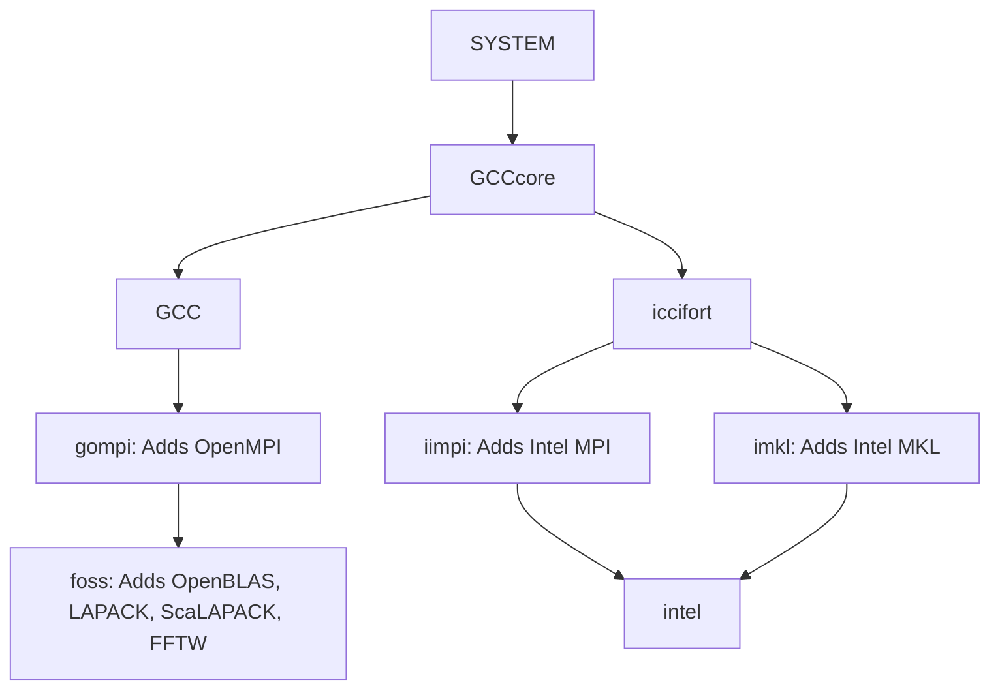

# Terminology

*[[back: The HPE Cray Programming Environment]](1_03_CPE.md)*

---

Over the years, we have come up with some terminology specific to EasyBuild
to refer to particular components, which we use alongside established terminology relevant to the context
of building and installing software.

It is important to be familiar with these terms, so we'll briefly cover them one by one.

---

## Toolchains

A *compiler toolchain* (or just *toolchain* for short) is a **set of [compilers](https://en.wikipedia.org/wiki/Compiler)**,
which are used to build software from source, together with a set of **additional libraries** that provide further core functionality.

We refer to the different parts of a toolchain as **toolchain components**.

The *compiler component* typically consists of [C](https://en.wikipedia.org/wiki/C_(programming_language)),
[C++](https://en.wikipedia.org/wiki/C%2B%2B), and [Fortran](https://en.wikipedia.org/wiki/Fortran)
compilers in the context of HPC, but additional compilers (for example,
a [CUDA](https://developer.nvidia.com/cuda-zone) compiler for
[GPGPU](https://en.wikipedia.org/wiki/General-purpose_computing_on_graphics_processing_units) software)
can also be included.

Additional toolchain components are usually special-purpose libraries:

-   an MPI library to support distributed computations (for example, [Open MPI](https://www.open-mpi.org/)
    or vendor-specific MPI implementations like Intel MPI in a toolchain based on the Intel compilers);
   
-   libraries providing efficient linear algebra routines ([BLAS](http://performance.netlib.org/blas/),
    [LAPACK](http://performance.netlib.org/lapack/), [ScaLAPACK](http://www.netlib.org/scalapack/));

    These libraries are included because they tend to provide a common API, so mixing them in a single 
    executable would cause name conflicts when linking.

-   a library supporting computing Fast Fourier Transformations (for example, [FFTW](http://fftw.org/));

These libraries are included because they are some of the most popular libraries in scientific software,
but also because they provide an API that is available through different implementations. Mixing 
implementations in a single build is a recipe for problems as the various implementations might
define the same symbols.

A toolchain that includes all of these libraries is referred to as a **full toolchain**, while
a **subtoolchain** is a toolchain that is missing one or more of these libraries.
A **compiler-only toolchain** only consists of compilers (no additional libraries).

The toolchain concept also maps nicely on the Programming Environment concept in the Cray
Programming Environment. Each ``PrgEnv-*`` module in fact provides a full toolchain in a
typical Cray PE installation, except for the FFTW library. Note that systems could configure 
the contents of a ``PrgEnv-*`` module differently as the MPI library and scientific library are 
optional. In the Cray PE, the MPI library is provided by the ``cray-mpic`` module, 
the BLAS, LAPACK and ScaLAPACK libraries by the ``cray-libsci`` module (for CPU-only nodes)
and the FFTW library through the ``cray-fftw`` module.

Many EasBuild toolchains are organised in a hierarchy. Each toolchain can use components compiled
with itself or with one of the subtoolchains. The Cray toolchains however are not currently 
organised in a hierarchy.

### System toolchain

The **`system` toolchain** is a special case which corresponds to using the compilers and libraries
*provided by the operating system*, rather than using toolchain components that were installed using EasyBuild.

It used sparingly, mostly to install software where no actual compilation is done or
to build a set of toolchain compilers and its dependencies, since the versions of the system compilers
and libraries are beyond the control of EasyBuild, which could affect the reproducibility of the installation.

On LUMI however it is used a bit more and it takes some of the functions of the ``GCCcore`` toolchain in
other EasyBuild toolchain hierarchies.

### Common toolchains

The `foss` and `intel` toolchains are also known as the *common toolchains*,
because they are widely adopted by the EasyBuild community.

The `foss` toolchain consists of all open source components (hence the name:
"FOSS" stands for Free & Open Source Software): [GCC](https://gcc.gnu.org/), [Open MPI](https://www.open-mpi.org/), [OpenBLAS](https://www.openblas.net/),
[ScaLAPACK](https://www.netlib.org/scalapack/) and [FFTW](http://fftw.org/).
In recent versions (since 2021a), [FlexiBLAS](https://www.mpi-magdeburg.mpg.de/projects/flexiblas)
is used as the BLAS library, with OpenBLAS and LAPACK as the backend.

The `intel` toolchain consists of the [Intel C, C++ and Fortran compilers](https://software.intel.com/content/www/us/en/develop/tools/compilers.html) (on top of a `GCC` version
controlled through EasyBuild) alongside the [Intel MPI](https://software.intel.com/content/www/us/en/develop/tools/mpi-library.html) and [Intel MKL](https://software.intel.com/content/www/us/en/develop/tools/math-kernel-library.html) libraries.

Roughly every 6 months, a new version of these common toolchains is agreed upon
in the EasyBuild community, after extensive testing.

The common toolchains are also organised in a toolchain hierarchy:

More information on these toolchains is available [in the EasyBuild documentation](https://docs.easybuild.io/en/latest/Common-toolchains.html).

---

## Modules

*Module* is a massively overloaded term in (scientific) software and IT in general
(kernel modules, Python modules, and so on).
In the context of EasyBuild, the term 'module' usually refers to an **environment module (file)**.

[Environment modules](https://en.wikipedia.org/wiki/Environment_Modules_(software)) is a well established concept
on HPC systems: it is a way to specify changes that should be made to one or more
[environment variables](https://en.wikipedia.org/wiki/Environment_variable) in a
[shell](https://en.wikipedia.org/wiki/Shell_(computing))-agnostic way. A module file
is usually written in either [Tcl](https://en.wikipedia.org/wiki/Tcl) or
[Lua](https://en.wikipedia.org/wiki/Lua_(programming_language)) syntax,
and specifies which environment variables should be updated, and how (append,
prepend, (re)define, undefine, etc.) upon loading the environment module.
Unloading the environment module will restore the shell environment to its previous state.

Environment module files are processed via a **modules tool**, of which there
are several conceptually similar yet slightly different implementations.
The Tcl-based [Environment Modules](https://sourceforge.net/projects/modules/) implementation, and
[Lmod](https://lmod.readthedocs.io), a more recent Lua-based implementation (which also supports module
files written in Tcl syntax), are the most commonly used ones.

**Environment module files are automatically generated for each software installation** by EasyBuild,
and *loading* a module results in changes being made to the environment of the current shell
session such that the corresponding software installation can be used.

---

## EasyBuild framework

The EasyBuild *framework* consists of a set of Python modules organised in packages (``easybuild.framework``,
``easybuild.toolchains``, ``easybuild.tools``, etc.) that collectively form **the core of EasyBuild**,
and is developed in the [``easybuild-framework`` repository on GitHub](https://github.com/easybuilders/easybuild-framework).

It implements the **common functionality that you need when building software from source**,
providing functions for unpacking source files, applying patch files, collecting the output produced
by shell commands that are being run and checking their exit code, generating environment module files, etc.

The EasyBuild framework does *not* implement any specific installation procedure, it only provides
the necessary functionality to facilitate this.

---

## Easyblocks

An *easyblock* is **a Python module that implements a specific software installation procedure**,
and can be viewed as a plugin to the EasyBuild framework. Easyblocks can be either *generic* or *software-specific*.

A **generic easyblock** implements an installation procedure that can be used for
multiple different software packages. Commonly used examples include the ``ConfigureMake`` easyblock
which implements the ubiquitous ``configure``-``make``-``make install`` procedure, and the
``PythonPackage`` easyblock that can be used to install a Python package.

A **software-specific easyblock** implements an installation procedure that is specific to a particular software packages.
Infamous examples include the easyblocks we have for ``GCC``, ``OpenFOAM``, ``TensorFlow``, ``WRF``, ...

The installation procedure performed by an easyblock can be controlled by defining
**easyconfig parameters** in an <a href="#easyconfig-files">easyconfig file</a>.

A collection of (generic and software-specific) easyblocks is developed by the EasyBuild community
in the [``easybuild-easyblocks`` repository on GitHub](https://github.com/easybuilders/easybuild-easyblocks).

---

## Easyconfig parameters

An **easyconfig parameter** specifies a particular aspect of a software installation that should be performed by
EasyBuild.

Some easyconfig parameters are **mandatory**. The following parameters *must* be defined in *every* easyconfig file:

* ``name`` and ``version``, which specify the name and version of the software to install;
* ``homepage`` and ``description``, which provide key metadata for the software;
* ``toolchain``, which specifies the compiler toolchain to use to install the software (see
  ``toolchains`` tab);

Other easyconfig parameters are **optional**: they can be used to provide required information,
or to control specific aspects of the installation procedure performed by the easyblock.

Some commonly used optional easyconfig parameters include:

* ``easyblock``, which specifies which (generic) easyblock should be used for the installation;
* ``sources`` and ``source_urls``, which specify the list of source files and where to download them;
* ``dependencies`` and ``builddependencies``, which specify the list of (build) dependencies;
* ``configopts``, ``buildopts``, and ``installopts``, which specify options for the configuration/build/install commands, respectively;

If no value is specified for an optional easyconfig parameter, the corresponding default value will be used.

There are two groups of easyconfig parameters. *General* easyconfig parameters can be defined for any software
package, and (usually) control a specific aspect of the installation. *Custom* easyconfig parameters are
only supported by certain easyblocks, and only make sense for particular (types of) software.

---

## Easyconfig files

*Easyconfig files* (or *easyconfigs* for short), are **simple text files written in Python syntax
that specify what EasyBuild should install**.
Each easyconfig file defines the set of **easyconfig parameters** that collectively form a complete specification
for a particular software installation.

The **filename** of an easyconfig file usually ends with the ``.eb`` extension.
In some contexts the filename is expected to be determined by the value of a handful of key
easyconfig parameters: ``name``, ``version``, ``toolchain`` and ``versionsuffix``. The general format for
the filename of an easyconfig file is: ``<name>-<version><toolchain>-<versionsuffix>.eb``,
where the toolchain part is omitted when a ``system`` toolchain is used, and the `<versionsuffix>` can be empty.

The filename of easyconfig files is particularly relevant when EasyBuild is searching for easyconfig files to resolve dependencies,
since it does this purely based on filenames: interpreting the contents of every (potential) easyconfig file
it encounters would be too expensive.

In the [``easybuild-easyconfigs`` repository on GitHub](https://github.com/easybuilders/easybuild-easyconfigs),
the EasyBuild community maintains a large (and growing) collection of easyconfig files, for a wide range of
(scientific) software.

---

## Easystack files

[**Easystack files**](https://docs.easybuild.io/en/latest/Easystack-files.html)
are a new concept in EasyBuild, providing a way to define a *software stack*
that should be installed by EasyBuild.

They are written in [YAML syntax](https://yaml.org/), and include a list of *software specifications*
which correspond to a list of easyconfig files, with support for providing specific EasyBuild
configuration options for particular software packages, and including or excluding specific software
packages based on labels.

The support for using easystack files is currently marked as *experimental*,
which means it is subject to change in future EasyBuild releases, and may be prone to errors.

---

## Extensions

*Extensions* is the collective term we use for **additional software packages that can be installed
on top of another software package**. Common examples are *Python packages*, *R libraries*, and *Perl modules*.

As you can tell the common terminology here is a bit messy, so we came up with a unifying term...

Extensions can be installed in different ways:

* *stand-alone*, as a separate installation on top of one or more other installations;
* as a part of a *bundle* of extensions that collectively form a separate installation;
* or as an actual *extension* to a specific installation to yield a "batteries included"
  type of installation (for examples by adding a bunch of Python packages from PyPI into
  a Python installation);

---

## Dependencies

A *dependency* is a common term in the context of software. It refers to **a software
package that is either strictly required by other software, or that can be leveraged to
enhance other software** (for example to support specific features).

There are three main types of dependencies for computer software:

* a **build dependency** is only required when building/installing a software package;
  once the software package is installed, it is no longer needed to *use* that software
  (examples: `CMake`, `pkg-config`);
* a **run-time dependency** (often referred to simply as *dependency*) is a software package that is
  required to *use* (or *run*) another software package (example: `Python`);
* a **link-time dependency** is somewhere in between a build and runtime dependency:
  it is only needed when *linking* a software package; it can become either a build or runtime
  dependency, depending on exactly how the software is installed (example: `OpenBLAS`);

The distinction between link-time and run-time dependencies is mostly irrelevant for this tutorial,
but we will discriminate build-only dependencies.

---

## Toolchains

A *compiler toolchain* (or just *toolchain* for short) is a **set of [compilers](https://en.wikipedia.org/wiki/Compiler)**,
which are used to build software from source, together with a set of **additional libraries** that provide further core functionality.

We refer to the different parts of a toolchain as **toolchain components**.

The *compiler component* typically consists of [C](https://en.wikipedia.org/wiki/C_(programming_language)),
[C++](https://en.wikipedia.org/wiki/C%2B%2B), and [Fortran](https://en.wikipedia.org/wiki/Fortran)
compilers in the context of HPC, but additional compilers (for example,
a [CUDA](https://developer.nvidia.com/cuda-zone) compiler for
[GPGPU](https://en.wikipedia.org/wiki/General-purpose_computing_on_graphics_processing_units) software)
can also be included.

Additional toolchain components are usually special-purpose libraries:

* an MPI library to support distributed computations (for example, [Open MPI](https://www.open-mpi.org/));
* libraries providing efficient linear algebra routines ([BLAS](http://performance.netlib.org/blas/),
  [LAPACK](http://performance.netlib.org/lapack/));
* a library supporting computing Fast Fourier Transformations (for example, [FFTW](http://fftw.org/));

A toolchain that includes all of these libraries is referred to as a **full toolchain**, while
a **subtoolchain** is a toolchain that is missing one or more of these libraries.
A **compiler-only toolchain** only consists of compilers (no additional libraries).

### System toolchain

The **`system` toolchain** is a special case which corresponds to using the compilers and libraries
*provided by the operating system*, rather than using toolchain components that were installed using EasyBuild.

It used sparingly, mostly to install software where no actual compilation is done or
to build a set of toolchain compilers and its dependencies, since the versions of the system compilers
and libraries are beyond the control of EasyBuild, which could affect the reproducibility of the installation.

### Common toolchains

The `foss` and `intel` toolchains are also known as the *common toolchains*,
because they are widely adopted by the EasyBuild community.

The `foss` toolchain consists of all open source components (hence the name:
"FOSS" stands for Free & Open Source Software): [GCC](https://gcc.gnu.org/), [Open MPI](https://www.open-mpi.org/), [OpenBLAS](https://www.openblas.net/),
[ScaLAPACK](https://www.netlib.org/scalapack/) and [FFTW](http://fftw.org/).

The `intel` toolchain consists of the [Intel C, C++ and Fortran compilers](https://software.intel.com/content/www/us/en/develop/tools/compilers.html) (on top of a `GCC` version
controlled through EasyBuild) alongside the [Intel MPI](https://software.intel.com/content/www/us/en/develop/tools/mpi-library.html) and [Intel MKL](https://software.intel.com/content/www/us/en/develop/tools/math-kernel-library.html) libraries.

Roughly every 6 months, a new version of these common toolchains is agreed upon
in the EasyBuild community, after extensive testing.

More information on these toolchains is available [in the EasyBuild documentation](https://docs.easybuild.io/en/latest/Common-toolchains.html).

---

## Modules

*Module* is a massively overloaded term in (scientific) software and IT in general
(kernel modules, Python modules, and so on).
In the context of EasyBuild, the term 'module' usually refers to an **environment module (file)**.

[Environment modules](https://en.wikipedia.org/wiki/Environment_Modules_(software)) is a well established concept
on HPC systems: it is a way to specify changes that should be made to one or more
[environment variables](https://en.wikipedia.org/wiki/Environment_variable) in a
[shell](https://en.wikipedia.org/wiki/Shell_(computing))-agnostic way. A module file
is usually written in either [Tcl](https://en.wikipedia.org/wiki/Tcl) or
[Lua](https://en.wikipedia.org/wiki/Lua_(programming_language)) syntax,
and specifies which environment variables should be updated, and how (append,
prepend, (re)define, undefine, etc.) upon loading the environment module.
Unloading the environment module will restore the shell environment to its previous state.

Environment module files are processed via a **modules tool**, of which there
are several conceptually similar yet slightly different implementations.
The Tcl-based [Environment Modules](https://sourceforge.net/projects/modules/) implementation, and
[Lmod](https://lmod.readthedocs.io), a more recent Lua-based implementation (which also supports module
files written in Tcl syntax), are the most commonly used ones.

**Environment module files are automatically generated for each software installation** by EasyBuild,
and *loading* a module results in changes being made to the environment of the current shell
session such that the corresponding software installation can be used.

---

## Bringing it all together

The EasyBuild **framework** leverages **easyblocks** to automatically build and install
(scientific) software, potentially including additional **extensions**, using a particular compiler **toolchain**,
as specified in **easyconfig files** which each define a set of **easyconfig parameters**.

EasyBuild ensures that the specified **(build) dependencies** are in place,
and automatically generates a set of **(environment) modules** that facilitate access to the installed software.

An **easystack file** can be used to specify a collection of software to install with EasyBuild.

---

*[[next: Installation]](installation.md)*
