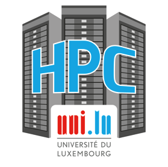

# What is EasyBuild?

<<<<<<< HEAD
<<<<<<< HEAD
*[[back: Course overview]](../index.md)*

**[EasyBuild](https://easybuild.io)** is a **software build and installation framework**
=======
*[[back: Overview]](index.md)*
=======
*[[back: Course overview]](../index.md)*
>>>>>>> ae27a051 (Correction of links.)

**[EasyBuild](http://easybuild.io)** is a **software build and installation framework**
>>>>>>> 549d7d34 (Restructuring for nicer navigation bar on the left.)
that manages (scientific) software in an efficient way, without compromising on performance.
Easybuild is especially tailored towards [**High Performance Computing (HPC)**](https://en.wikipedia.org/wiki/Supercomputer) systems,
and provides a **command-line interface** to facilitate the installation and management of a scientific software stack.

---

<<<<<<< HEAD
<a href="https://geek-and-poke.com/geekandpoke/2010/5/14/how-to-become-invaluable.html">

=======
<a href="http://geek-and-poke.com/geekandpoke/2010/5/14/how-to-become-invaluable.html">
<<<<<<< HEAD

>>>>>>> 549d7d34 (Restructuring for nicer navigation bar on the left.)
=======

>>>>>>> ae27a051 (Correction of links.)
</a>

## Elevator pitch

EasyBuild intends to relieve HPC support teams from manually managing
software installations while at the same time **providing a consistent and well performing
scientific software stack** to end users of HPC systems.

It serves as a **uniform interface for installing scientific software**
and saves valuable time (and frustration) by the automation of tedious, boring and repetitive tasks. 

In addition, EasyBuild can **empower scientific researchers to self-manage their software stack**,
and it can serve as a tool that can be leveraged for **building optimized container images**.

The project has grown to become a **platform for collaboration** among HPC sites worldwide.

---

On LUMI we pay a lot of attention to empowering users to create their custom software stack which
is best suited for their project without being confronted with hundreds of modules that are not
useful to them. It also enables them to easily customize the build instructions to create a 
project-specific build or even to install software with custom patches to adapt to their needs.
For this we offer both [EasyBuild](https://easybuild.io/) and [Spack](https://spack.io/) 
as tools but obviously this tutorial concentrates on EasyBuild alone.

EasyBuild can also be used to [generate container recipes](https://docs.easybuild.io/en/latest/Containers.html) 
that will then use EasyBuild when building
the container to install platform-optimised software in the container. However, as that functionality
is still under development on LUMI it is not yet covered in this LUMI-specific version of the tutorial.

---

## Key features

EasyBuild is capable of **fully autonomously installing (scientific) software**,
including making sure that all necessary dependencies are installed,
and automatically generating environment module files.

***No*** **admin privileges are required**: it is sufficient to have write permissions
to the preferred software installation prefix.

EasyBuild is [**highly configurable**](https://docs.easybuild.io/en/latest/Configuration.html) via configuration files,
environment variables, and command line options. Various elements of the functionality can be
[**dynamically extended**](https://docs.easybuild.io/en/latest/Including_additional_Python_modules.html) via plugins,
and [**hooks**](https://docs.easybuild.io/en/latest/Hooks.html) are available for further site-specific customizations.

The installation procedure executed by EasyBuild is thoroughly
[**logged**](https://docs.easybuild.io/en/latest/Logfiles.html), and is fully transparent via support for
[**dry runs**](https://docs.easybuild.io/en/latest/Extended_dry_run.html) and
[**tracing**](https://docs.easybuild.io/en/latest/Tracing_progress.html) the software installation procedure
as it is performed.

EasyBuild supports using a **custom module naming scheme**, allows for
*hierarchical* module naming schemes, and **integrates with various other tools** ranging from  resource managers ([Slurm](https://slurm.schedmd.com) and [GC3Pie](https://github.com/gc3pie/gc3pie)),
<<<<<<< HEAD
container tools ([Singularity](https://github.com/apptainer/singularity) and [Docker](https://www.docker.com)),
=======
container tools ([Singularity](https://github.com/hpcng/singularity) and [Docker](https://www.docker.com)),
>>>>>>> 549d7d34 (Restructuring for nicer navigation bar on the left.)
packaging tools ([FPM](https://fpm.readthedocs.io)), and so on.

---

## Focus points

EasyBuild was created specifically for **installing scientific software on HPC systems**,
which is reflected in some of the design choices that were made.

### Performance

EasyBuild strongly prefers to **build software from source code**, whenever possible.

This is important to ensure that the binaries that are installed can maximally exploit
the capabilities of the system architecture on which the software will be run.

For that same reason, EasyBuild out-of-the-box **optimizes software for the processor architecture of the build host**
by default, via compiler options like ``-march=native`` (GCC), ``-xHost`` (Intel compilers), etc.
This behaviour [can be changed via the ``--optarch`` configuration setting](https://docs.easybuild.io/en/latest/Controlling_compiler_optimization_flags.html).
When using the HPE Cray Programming Environment, the target modules are used instead.
In principle it is possible to cross-compile with EasyBuild, but this comes with some pitfalls. 
By default EasyBuild tries to run tests if the build process of a package provides that
functionality, or can run simple tests of its own, and of course these tests will fail if 
the host CPU does not support the full instruction set of the target CPU. Secondly, more
and more software has broken build processes where developers thought that it was a good 
<<<<<<< HEAD
idea to hard-code options such as ``-march=native`` or ``-xHost`` in a way that EasyBuild
=======
idea to hard-code options such as ``-march=native`` or ``--xHost`` in a way that EasyBuild
>>>>>>> 549d7d34 (Restructuring for nicer navigation bar on the left.)
cannot easily overwrite those.

### Reproducibility

In addition to performance, **reproducibility of installations** is a core aspect of EasyBuild.

<<<<<<< HEAD
Most software installations performed with EasyBuild use a **particular compiler <a href="../1_05_terminology#toolchains">toolchain</a>**,
=======
TODO correct link in the next lines.

Most software installations performed with EasyBuild use a **particular compiler <a href="#toolchains">toolchain</a>**,
>>>>>>> 549d7d34 (Restructuring for nicer navigation bar on the left.)
with which we aim to be in control over the build environment and avoid relying on tools and libraries
provided by the operating system. For similar reasons, we try to **provide all required dependencies through EasyBuild** as well,
with a few notable exceptions, like ``OpenSSL`` for security reasons, and Infiniband and GPU drivers which
are too closely intertwined with the operating system.

For both toolchains and dependencies, **fixed software versions** are specified in the
<<<<<<< HEAD
<a href="../1_05_terminology#easyconfig-files">easyconfig files</a>. That way, easyconfig files can easily be shared with others:
=======
<a href="#easyconfig-files">easyconfig files</a>. That way, easyconfig files can easily be shared with others:
>>>>>>> 549d7d34 (Restructuring for nicer navigation bar on the left.)
if they worked for you it is very likely that they will work for others too, because the vast majority of the
software stack is controlled by EasyBuild.

As we shall see when discussing the HPE Cray Programming Environment, the reproducibility is a bit more limited
in that environment due to the way the programming environment selects shared libraries at runtime.

### Community effort

In a number of different ways, we try to encourage EasyBuild users to **collaborate** and help each other out.

We actively recommend people to report problems and bugs, to submit ideas for additional features and improvements,
and to [**contribute back**](https://docs.easybuild.io/en/latest/Contributing.html) when possible, be it
by opening pull requests to the [GitHub repositories](https://github.com/easybuilders) or the [documentation](https://docs.easybuild.io).

The EasyBuild community also provides packages for two standard toolchains, called the 
<<<<<<< HEAD
[**common toolchains**](https://docs.easybuild.io/en/latest/Common-toolchains.html). 
The so-called ``foss`` is based on free and open software (GNU compilers, FlexiBlas with OpenBLAS backend, LaPACK, FFTW and Open MPI)
while the ``intel`` toolchain uses the full stack of Intel compilers, libraries and MPI. Currently these toolchains
cannot be supported on LUMI though as getting Open MPI to run on LUMI is challenging and as the Intel libraries and
some MPI versions also produce slow or incorrect results on AMD CPUs (and it is not entirely clear if Intel MPI is compatible
with SlingShot 11, though in principle it should). 
=======
[**common toolchains**](https://easybuild.readthedocs.io/en/latest/Common-toolchains.html). 
The so-called ``foss`` is based on free and open software (GNU compilers, FlexiBlas with OpenBLAS backend, LaPACK, FFTW and Open MPI)
while the ``intel`` toolchain uses the full stack of Intel compilers, libraries and MPI. Currently these toolchains
cannot be supported on LUMI though as getting Open MPI to run on LUMI is challenging and as the Intel libraries and
some MPI versions also produce slow or incorrect results on AMD CPUs (and it is not clear if Intel MPI is compatible
with SlingShot 11). 
>>>>>>> 549d7d34 (Restructuring for nicer navigation bar on the left.)
Focusing the efforts on those two popular common toolchains makes it possible to support a lot of build recipes that are
collected in the [central repository](https://github.com/easybuilders/easybuild-easyconfigs).
They can still serve as a basis to develop build recipes for the HPE Cray Programming Environment.

<<<<<<< HEAD
Last but not least, EasyBuild provides various [**GitHub integration features**](https://docs.easybuild.io/en/latest/Integration_with_GitHub.html)
=======
Last but not least, EasyBuild provides various [**GitHub integration features**](https://easybuild.readthedocs.io/en/latest/Integration_with_GitHub.html)
>>>>>>> 549d7d34 (Restructuring for nicer navigation bar on the left.)
that greatly facilitate the contribution process: opening, updating, and testing pull requests,
reviewing incoming contributions, and much more can all be done directly from the EasyBuild
command line. This not only saves time, effort, brain cycles, and mouse clicks for contributors,
but it also makes the review process for *maintainers* significantly easier.
All together this leads to improved stability and consistency.

---

## What EasyBuild is ***not***

EasyBuild is ***not*** **YABT (Yet Another Build Tool)**: it does *not* replace established build
tools like CMake or ``make``, it wraps around them.
If the installation procedure of a software package involves running some unholy trinity of tools while whispering
the correct magic incantations, EasyBuild automates this process for you.

It is ***not*** **a replacement for traditional Linux package managers** like ``yum``, ``dnf`` or ``apt``.
EasyBuild relies on certain tools and libraries provided by the operating system. This includes glibc, OpenSSL,
drivers for Infiniband and GPUs, and so on. It is required that these tools are installed and managed by other means.
This is typically done via the package management tool that comes with your Linux distribution.

Finally, EasyBuild is ***not*** **a magic solution to all your (software installation) problems**.
You may, and probably still will occasionally, run into compiler errors unless somebody has already taken care of the problem for you.
This is even more likely to happen in the Cray environment as builds are not often tested with the Cray compilers 
or even with the AMD compilers.

---

## Requirements

Since EasyBuild is primarily intended for installing (scientific) software on HPC systems, the main target is
systems running some flavor of **GNU/Linux**. EasyBuild also works on *macOS*,
but significant effort would be required to use it extensively there.

<<<<<<< HEAD
<<<<<<< HEAD

=======

>>>>>>> 549d7d34 (Restructuring for nicer navigation bar on the left.)
=======

>>>>>>> ae27a051 (Correction of links.)

EasyBuild is implemented in [**Python**](https://www.python.org), and is compatible with Python 2.7 and 3.5+.
Since [Python 2 is no longer maintained](https://blog.python.org/2020/04/python-2718-last-release-of-python-2.html),
it is recommended to use a recent version of Python 3 for running EasyBuild.

An [**environment modules**](https://en.wikipedia.org/wiki/Environment_Modules_(software)) tool is required for running EasyBuild.
The modern Lua-based implementation **[Lmod](https://lmod.readthedocs.io)** is strongly recommended,
but other (Tcl-based) implementations are also supported.
Both Tcl and Lua are supported as syntax for environment module files.
On LUMI Lmod is used as the module tool.

---

## Development

<<<<<<< HEAD
<<<<<<< HEAD

=======

>>>>>>> 549d7d34 (Restructuring for nicer navigation bar on the left.)
=======

>>>>>>> ae27a051 (Correction of links.)
EasyBuild is **actively developed** by a worldwide community under the
[**GPLv2 open source license**](https://www.gnu.org/licenses/old-licenses/gpl-2.0.html)
via the [**``easybuilders``** organisation on GitHub](https://github.com/easybuilders), in the following repositories:

-   [easybuild-framework](https://github.com/easybuilders/easybuild-framework)
-   [easybuild-easyblocks](https://github.com/easybuilders/easybuild-easyblocks)
-   [easybuild-easyconfigs](https://github.com/easybuilders/easybuild-easyconfigs)
-   [easybuild](https://github.com/easybuilders/easybuild) (website, documentation)
-   [easybuild-tutorial](https://github.com/easybuilders/easybuild-tutorial) (the generic EasyBuild tutorials)

On LUMI the generic EasyBuild installation is used but extended and adapted using LUMI-specifics 
plugins and hooks maintained in the [LUMI software stack repository](https://github.com/Lumi-supercomputer/LUMI-SoftwareStack).

Stable versions of EasyBuild have been released roughly every 6-8 weeks since 2012,
and are published via the *Python Package Index (PyPI)*,
see [https://pypi.org/project/easybuild](https://pypi.org/project/easybuild/).

**Comprehensive testing** practices are applied throughout the
development cycle, with extensive suites of unit and integration tests being run in a CI environment (GitHub Actions),
consistent testing of incoming contributions (pull requests), and thorough regression testing before every release.

---

## A worldwide community

EasyBuild has grown into a **community project** since it was first released publicy in 2012,
and is used and developed by dozens (hundreds?) of HPC centres and consortia worldwide.

Since 2016 the EasyBuild community has gathered for a yearly [**EasyBuild User Meeting**](https://easybuild.io/eum),
which is an open and highly interactive event that provides a great opportunity to meet fellow EasyBuild users,
developers, and maintainers, and to discuss related topics, learn about new aspects of the tool, and how other HPC
sites leverage it, and integrate it with other tools like [Jenkins](https://www.youtube.com/watch?v=bzW45cfRUMU),
[Ansible](https://www.youtube.com/watch?v=Qr2udsAjkG0), [CernVM-FS](https://www.youtube.com/watch?v=_0j5Shuf2uE),
[ReFrame](https://www.youtube.com/watch?v=KN9QwQIrso4) etc.

HPC sites, consortia, and companies that use EasyBuild include (but are not limited to):

<<<<<<< HEAD
<<<<<<< HEAD
a href="https://www.vscentrum.be"></a>

=======

>>>>>>> ae27a051 (Correction of links.)

<<<<<<< HEAD

=======

>>>>>>> 549d7d34 (Restructuring for nicer navigation bar on the left.)
=======

>>>>>>> ae27a051 (Correction of links.)

---

## Getting help

### *Documentation*

If you have any questions about EasyBuild, make sure to check the EasyBuild documentation first,
which is available at [**https://docs.easybuild.io**](https://docs.easybuild.io).

It is not unlikely that an answer to your question is available there already.
The [search box](https://docs.easybuild.io/en/latest/search.html) on the top left may be helpful.

### GitHub

You can open an issue in one of the EasyBuild repositories in [the `easybuilders` GitHub organisation](https://github.com/easybuilders/) to
ask questions, report problems or share suggestions and ideas for additional
improvements.

Please try to post the issue in the most suitable repository. If you are
not sure which repository is most suited just go ahead and open the issue anyway,
the EasyBuild maintainers can move your issue if deemed appropriate.

Also here you can use the search box on the top left, to see if somebody else
has already asked a similar question or reported a similar problem.

### Mailing list

Feel free to ask any questions or provide feedback via the EasyBuild mailing list
<a href="mailto:easybuild@lists.ugent.be">`easybuild@lists.ugent.be`</a>.

Keep in mind that **you must be subscribed to the mailing list in order to
post messages there!** You can subscribe via [this link](https://lists.ugent.be/wws/subscribe/easybuild).

In 2016-2017 over 1,000 messages were posted to the EasyBuild mailing list.
More recently this has decreased to about 700 messages per year, mostly due
to the EasyBuild Slack channel.

### Slack

The [EasyBuild Slack](https://easybuild.slack.com/) is a quick and easy way
to get in touch with the EasyBuild community.
Over 400 people have joined it so far, and there is usually somebody awake in there
who may be able to help you out.

**To join the EasyBuild Slack request an invitation via
[https://easybuild-slack.herokuapp.com](https://easybuild-slack.herokuapp.com/).**

If you are not a big fan of Slack, you can also consider joining the `#easybuild`
IRC channel (available on the [Freenode IRC network](https://freenode.net/)).
A bot relays messages between this IRC channel and the `#general` channel in the EasyBuild Slack.

### Conference calls

Every other week on Wednesday an EasyBuild conference call is set up to discuss recent
developments, provide an outlook to the next EasyBuild release, and
provide answers to questions that can be raised by the people attending the call.

These conference calls are open to anyone interested in the EasyBuild project,
and have been organised since November 2013.

More information, including the dates and times of the next calls, is available 
[on the EasyBuild Wiki](https://github.com/easybuilders/easybuild/wiki/Conference-calls).

---

*[[next: The Lmod module system]](1_02_Lmod.md)*
