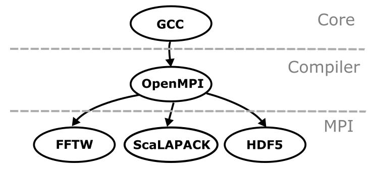
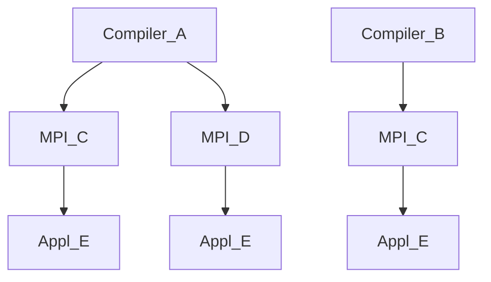

# The Lmod module system

*[[back: What is EasyBuild?]](1_01_what_is_easybuild.md)*

---

## Modules

*Module* is a massively overloaded term in (scientific) software and IT in general
(kernel modules, Python modules, and so on).
In the context of EasyBuild, the term 'module' usually refers to an **environment module (file)**.

[Environment modules](https://en.wikipedia.org/wiki/Environment_Modules_(software)) is a well established concept
on HPC systems: it is a way to specify changes that should be made to one or more
[environment variables](https://en.wikipedia.org/wiki/Environment_variable) in a
[shell](https://en.wikipedia.org/wiki/Shell_(computing))-agnostic way. A module file
is usually written in either [Tcl](https://en.wikipedia.org/wiki/Tcl) or
[Lua](https://en.wikipedia.org/wiki/Lua_(programming_language)) syntax,
and specifies which environment variables should be updated, and how (append,
prepend, (re)define, undefine, etc.) upon loading the environment module.
Unloading the environment module will restore the shell environment to its previous state.

Environment module files are processed via a **modules tool**, of which there
are several conceptually similar yet slightly different implementations.
The oldest module tool still in use today is Environment Modules 3.2, implemented in C and 
supporting module files written in Tcl. After a gap in development, Xavier Delaruelle of CEA
developed [Environment Modules 4 and 5](https://sourceforge.net/projects/modules/) which is
fully implemented on Tcl. An alternative module tool is [Lmod](https://lmod.readthedocs.io), 
developed by Robert McLay at TACC and implemented in LUA. This tool supports natively LUA
module files but also offers a high degree of compatibility with Tcl-based module files
developed for Environment Modules fia a translation layer and some API translation.

The Cray PE offers a choice between the old-style Environment Modules 3.2 and Lmod, but no
packages or official support for Environment Modules 4 or 5. At the user level, 
Environment Modules 3.2 and Lmod have many commands in common, but with different options. 
Lmod also has some powerful features that are lacking in Environment Modules 3.2.

!!! Note "The Cray PE on LUMI"
    On LUMI, Lmod was selected as the module tool. One area where there are significant
    differences between Environment Modules 3.2 (and also the newer versions) and Lmod is
    in the commands for discovering modules on the system. If you are not familiar with Lmod 
    and its commands for users, it is worthwhile to read the 
    [LUMI documentation page on Lmod](https://docs.lumi-supercomputer.eu/computing/Lmod_modules/).
    Some of those commands are also discussed on this page.

---

## Lmod hierarchy

### User view

Lmod supports a module hierarchy. In a hierarchy, there is a distinction between the *installed
modules* and the *available modules*. Available modules are those that can be loaded directly 
without first loading any other module, while the installed modules is the complete set of 
modules that one could load one way or another. A typical use case
is a hierarchy to deal with different compilers on a system and different MPI implementations.
After all, it is a common practice to only link libraries and application code compiled with the
same compiler to avoid compatibility problems between compilers (and to be able to use advanced
features such as link time optimization). This is even more important for MPI, as Open MPI and 
MPCIH-derived MPI implementations have incompatible Application Binary Interfaces. This would lead
to a hierarchy with 3 levels:

1.  The ``Core`` level containing the modules for the compilers themselves, e.g., one or more versions
    of the GNU compiler suite and one or more versions of LLVM-based compilers.

    Loading a compiler module would then make the next level available:

2.  The ``Compiler`` level, containing modules for libraries and packages that only rely on the compilers
    but do not use MPI, as well as the MPI modules, e.g., a version of Open MPI and a version of MPICH.

    Loading one of the MPI modules would then make the next level available:

3.  The ``MPI`` level, containing libraries and applications that depend on the compiler used and the MPI
    implementation.

??? Example "A simple Lmod hierarchy with a single compiler"

    Here is a simple example of such a 3-level module hierarchy
    (that almost could have been generated by EasyBuild):

    <div align="center"></div>

    In this example the ``Core`` level only includes a single module `GCC/9.3.0`,
    while  the ``Compiler`` level includes two modules: `OpenMPI/4.0.3` and `MPICH/3.3.2`.
    In the ``MPI `` level, three modules are available: one for `FFTW`, one for `ScaLAPACK`, 
    and one for `HDF5`.

    Initially only the modules on the top level of a module hierarchy are available for loading.
    If you run "`module avail`", the command that is used to view all modules that are available
    for loading, with this example module hierarchy, you will only see the `GCC/9.3.0` module.

    Some modules in the top level of the hierarchy act as a "gateway" to modules in the
    next level below.
    To make additional modules available for loading one of these gateway modules has to be loaded. 
    In our example, loading the `GCC/9.3.0` module results in two additional modules coming into
    view from the ``Compiler`` level, as indicated by the arrows: the modules for `OpenMPI` and `MPICH`. 
    These correspond to installations of `OpenMPI`
    and `MPICH` that were built using `GCC/9.3.0`.

    Similarly, the `OpenMPI/4.0.3` module serves as a gateway to the three modules in the ``MPI`` level. 
    Only by loading the `OpenMPI` module will these additional three modules become
    available for loading. They correspond to software installations built using the ``GCC/9.3.0``
    compiler with ``OpenMPI/4.0.3``. 

Now assume that we have two compilers in the hierarchy, Compiler_A and Compiler_B. Their modules would reside
at the ``Core`` level. Both compilers provide the same MPI implementation, MPI_C. So there would be two modules
for ``MPI_C`` in two different subdirectories at the ``Compiler`` level. And further assume that we have an
application, Appl_E, compiled with both Compiler_A and Compiler_B and using MPI_C. For that application there would
also be two module files at the ``MPI`` level,  one in a subdirectory corresponding ao Compiler_A and MPI_C and one
in a subdirectory corresponding to Compiler_B and MPI_C. 




To be able to load the module for Appl_E, a user should
first load Compiler_A, then load MPI_C and only then is it possible to load the module for Appl_E:

```bash
module load Compiler_A MPI_C Appl_E
```

What is interesting is what happens if the user now loads Compiler_B:

```bash
module load Compiler_B
```

In a properly designed and implemented hierarchy, Lmod will unload Compiler_A which will also trigger the unloading/deactivation
of MPI_C and Appl_E. It will then load the module for Compiler_B and proceed with looking if it can find another module for
MPI_C. That will then be loaded which now makes a different module for Appl_E available, which Lmod will proceed to load. If it
cannot find an exact match for the version, Lmod will even try to locate a different version. Hence the situation after loading 
Compiler_B is that now modules are loaded for Compiler_B, MPI_C for Compiler_B and Appl_E for Compiler_A with MPI_C.
All this requires very little effort from the module file programmer and very little logic in the module files. E.g., rather
then implementing a single module file for Appl_E that would require logic to see which compiler and MPI implementation is loaded
and depending on those adapt the path to the binaries, several very simple modules need to be written with very little 
logic, and one could add an Appl_E module for a different compiler or MPI implementation without touching any of the already
existing module files for that application.

Similarly, if after

```bash
module load Compiler_A MPI_C Appl_E
```

one does 

```bash
module load MPI_D
```

thent MPI_C gets unloaded, Lmod notices that it also has to unload/deactivate Appl_E, then will load MPI_D for Compiler_A and
finally will notice that there is an equivalent Appl_E module available again, and Lmod will load that one also. However,
now loading Compiler_B will cause a warning that MPI_D and Appl_E have been deactivated as there is no module name MPI_D in
any version for Compiler_B.


### Building blocks

Some mechanisms in Lmod make implementing a hierarchy fairly easy (though there are a lot of hidden pitfalls)

-   The *MODULEPATH* environment variable determines which modules are available. MODULEPATH is different from any other 
    path-style variable in Lmod in that any change will immediately trigger a re-evaluation of which modules are available
    and trigger deactivating modules that are no longer available when a directory is removed from the MODULEPATH or
    looking for alternatives for deactivated modules when a directory is added to the MODULEPATH.

-   The *"one name rule"*: Lmod cannot have two modules loaded with the same name (but a different version). By default, when loading
    a module with the name of an already loaded module, Lmod will automatically swap the old one with the new one, i.e., unload the
    already loaded module and load the new one. 

-   The *family* concept: It is possible to declare a module to be part of a family using a command in the module file. No two modules
    of the same family can be loaded at the same time, and Lmod will again by default auto-swap the already loaded one with the one
    being loaded. The procedure is different though as Lmod now first has to read the new module file to discover the family, and this
    may lead to more side effects. But that discussion is outside the scope of this tutorial.

    The family concept was for a long time a unique feature of Lmod, but it has been added now also to Environment Modules version 5.1.


### Implementation details

The above example could be implemented using 8 module files: One for each compiler, three for the MPI modules
(two for MPI_C and one for MPI_D) and 
three for the application modules.

```
moduleroot
├── Core
│   ├── Compiler_A
│   │   └── version_A.lua
│   └── Compiler_B
│       └── version_B.lua
├── Compiler
│   ├── Compiler_A
│   │   └── version_A
│   │       ├── MPI_C
│   │       │   └── version_C.lua
│   │       └── MPI_D
│   │           └── version_D.lua
│   └── Compiler_B
│       └── version_B
│           └── MPI_C
│               └── version_C.lua
└── MPI
    ├── Compiler_A
    │   └── version_A
    │       ├── MPI_C
    │       │   └── version_C
    │       │       └── Appl_E
    │       │           └── version_E.lua
    │       └── MPI_D
    │           └── version_D
    │               └── Appl_E
    │                   └── version_E.lua
    └── Compiler_B
        └── version_B
            └── MPI_C
                └── version_C
                    └── Appl_E
                        └── version_E.lua
```

Besides the module functions needed to create the environment needed to run the compiler, the module file for
Compiler_A would need only two lines to implement the hierarchy:

```Lua
family('Compiler')
prepend_path('MODULEPATH', 'moduleroot/Compiler/Compiler_A/version_A')
```

There are now two different ``version_C.lua`` files. One contains the necessary calls to module functions to
initialise the environment to use the version compiled with Compiler_A/version_A while the other contains the
necessary functions to do that for Compiler_B/version_B. Again, two more lines are needed to implement the hierarchy.
E.g., for ``moduleroot/Compiler/Compiler_A/version_A/MPI_C/version_C.lua``: 

```Lua
family('MPI')
prepend_path('MODULEPATH', 'moduleroot/MPI/Compiler_A/version_A/MPI_C/version_C')
```

Finally two versions of the ``version_E.lua`` file are needed, one to prepare the environment for using the 
package with Compiler_A anmd MPI_C and one for using the package with Compiler_B and MPI_C. However, these
are just regular modules and no additions are needed to work for the hierarchy.

Both EasyBuild and Spack support Lmod hierarchies and with these tools it is also fairly automatic to create
different versions of the module files for each compiler and MPI library used to build the application. When
hand-writing modules it may be more interesting to have a generic module which would work for all those cases
and that is also possible with Lmod. Lmod does have a range of *introspection functions* that a module can use 
to figure out its name, version and place in the module tree. All that would be needed is that the various
instances of the module file are at the correct location in the module tree and link to the generic file which
can be outside the module tree. In fact, this feature is used on LUMI to implement the modules that load a
particular version of the hardware for a particular section of LUMI.

---

## Finding modules

In a hierarchical setup, not all modules are available at login. This implies that a user cannot use
``module avail`` to discover which software is available on the system. To this end Lmod has powerful
search commands. It is important to understand how these commands work to ensure that the proper information
is included in the module files to improve discoverability of software.

!!! Note "Documentation in the LUMI documentation"
    Extensive information on search commands with examples of how to use them on LUMI can be found
    in the [LUMI documentation]([https://)](https://docs.lumi-supercomputer.eu/), in
    [the computing section, "Module environment page", "Finding modules" section](https://docs.lumi-supercomputer.eu/computing/Lmod_modules/#finding-modules).


### module spider command

The available modules at any point in time are often only a subset of all installed modules on a
system. However, Lmod provides the ``module spider`` command to search for a module with a given name 
among all installed modules and to tell you how this module can be loaded (i.e., which other modules
need to be loaded to make the module available).

The ``module spider`` command has three levels, producing different outputs:

 1. ``module spider`` without further arguments will produce a list of all
    installed software and show some basic information about those packages.
    Some packages may have an ``(E)`` behind their name and will appear in blue
    (in the default colour scheme) which means that they are part of a different
    package. These are called *extensions*  of packages or modules.
    This is explained a little further in this page.

    Note that ``module spider`` will also search in packages that are hidden from
    being displayed. These packages can be loaded and used. However administrators
    may have decided to hide them
    either because they are not useful to regular users or because they think that
    they will rarely or never be directly loaded by a user and want to avoid
    overloading the module display.

 2. ``module spider <name of package>`` will search for the specific package. This
    can be the name of a module, but it will also search some other information
    that can be included in the modules. The search is also case-insensitive.
    E.g., on LUMI
    ```bash
    module spider GNUplot
    ```
    will show something along the lines of
    ```
    ------------------------------------------------------------------
      gnuplot:
    ------------------------------------------------------------------
        Description:
          Gnuplot is a portable command-line driven graphing utility

         Versions:
            gnuplot/5.4.2-cpeCray-21.08
            gnuplot/5.4.2-cpeGNU-21.08
    ```
    so even though the capitalisation of the name was wrong, it can tell us that
    there are two versions of gnuplot. The ``cpeGNU-21.08`` and ``cpeCray-21.08``
    tell that the difference is the compiler that was used to install gnuplot,
    being the GNU compiler (PrgEnv-gnu) and the Cray compiler (PrgEnv-cray)
    respectively.

    In some cases, if there is no ambiguity, `module spider` will actually
    already produce help about the package, which is the next level.

  3. `module spider <module name>/<version>` will show more help information
     about the package, including information on which other modules need to be
     loaded to be able to load the package. E.g., 
     ```bash
     module spider git/2.35.1
     ```
     will return something along the lines of
     ```
     -------------------------------------------------------------------
       git: git/2.35.1
     -------------------------------------------------------------------
        Description:
          Git is a free and open source distributed version control
          system

        You will need to load all module(s) on any one of the lines below
        before the "git/2.35.1" module is available to load.

          CrayEnv
          LUMI/21.12  partition/C
          LUMI/21.12  partition/D
          LUMI/21.12  partition/G
          LUMI/21.12  partition/L

        Help:
     ```
     (abbreviated output). Note that it also tells you which other modules need
     to be loaded. You need to choose the line which is appropriate for you and
     load all modules on that line, not the whole list of in this case 9
     modules.

!!! failure "Known issue"
    The Cray PE uses Lmod in an unconventional manner with the hierarchy not
    build fully in the way Lmod expects. As a consequence Lmod is not always
    able to generate the correct list of modules that need to be loaded to make
    a package available, and the list of ways to make a module available may 
    also be incomplete.

    The problem is somewhat aggrevated on LUMI because the Cray PE hierarchy sits
    next to the hierarchy of the software stack as the Cray PE is installed 
    separately and hence cannot be integrated in the way the Lmod developer had
    in mind.


#### Module extensions

Certain packages, e.g., Python, Perl or R, get a lot of their functionality through 
other packages that are installed together with them and extend the functionity, 
e.g., NumPy and SciPy for Python. Installing all those packages as separate modules
to make it easy to see if they are installed or not on a system would lead to an
overload of modules on the system. 

Similarly, admins of a software stack may chose to bundle several libraries or tools
that are often used together in a single module (and single installation directory),
e.g., to reduce module clutter but also to reduce the length of the search paths for
binaries, libraries or manual pages to speed up loading of applications.

Lmod offers a way to make those individual packages installed in a module discoverable
by declaring them as *extensions* of the module. The ``module spider`` command will
search for those too.

 1. ``module spider`` without further arguments: The output may contain lines similar
    to
    ```
    -----------------------------------------------------------------------
    The following is a list of the modules and extensions currently available:
    -----------------------------------------------------------------------
      Autoconf: Autoconf/2.71 (E)

      CMake: CMake/3.21.2 (E), CMake/3.22.2 (E)
    ```
    which tells that ``Autoconf`` and ``CMake`` are not available as modules themselves
    but as extensions of another module, and it also tells the versions that are available,
    though that list may not be complete (and is not always complete for modules either
    as it is limited to one line of output).

2.  ``module spider <name of package>`` will search for extensions also. E.g.,
    ```
    module spider CMake
    ```
    on LUMI will return something along the lines of
    ```
    -----------------------------------------------------------------------
      CMake:
    -----------------------------------------------------------------------
         Versions:
            CMake/3.21.2 (E)
            CMake/3.22.2 (E)
    ```
    (output abbreviated). 
    This tells that there is no ``CMake`` module on the system but that two versions
    of ``CMake`` are provided in another module.

  3. `module spider <extension name>/<version>` will show more information on the
     extension, including which module provides the extension and which other modules
     have to be loaded to make that module available. E.g., on LUMI,
     ```
     module spider CMake/3.22.2
     ```
     will output something along the lines of
     ```
     -----------------------------------------------------------------------
      CMake: CMake/3.22.2 (E)
    -----------------------------------------------------------------------
        This extension is provided by the following modules. To access the 
        extension you must load one of the following modules. Note that any 
        module names in parentheses show the module location in the software 
        hierarchy.

           buildtools/21.12 (LUMI/21.12 partition/L)
           buildtools/21.12 (LUMI/21.12 partition/G)
           buildtools/21.12 (LUMI/21.12 partition/D)
           buildtools/21.12 (LUMI/21.12 partition/C)
           buildtools/21.12 (CrayEnv)
    ```
    (output abbreviated and slightly reformatted for readability). This tells that
    ``CMake/3.22.2`` is provided by the ``bvuildtools/21.12`` module and that there
    are 5 different ways to make that package available.

??? Bug "Restrictions with older Lmod versions"
    At the time of development of this tutorial, Cray is still using the pretty old
    8.3.1 version of Lmod. Even though extensions were supported since Lmod version 8.2.5,
    Lmod 8.3.1 has several problems:

    -   It is not possible to hide extensions in the output of ``module avail``, a feature
        that only became available in version 8.5. This may be annoying to many users as
        the extension list of packages such as Python, R and Perl can be very long (the
        default EasyBuild installation of R contains on the order of 600 packages).

        For that reason on LUMI extensions are only used for some modules.

    -   ``module avail`` also shows extensions for modules that are not available which
        makes no sense. This bug was only corrected in Lmod 8.6.13 and 8.6.14.
 

### module keyword

Another search command that is sometimes useful is `module keyword`. It really
just searches for the given word in the short descriptions that are included in
most module files and in the name of the module. The output is not always
complete since not all modules may have a complete enough short description.

Consider we are looking for a library or package that supports MP3 audio
encoding.
```bash
module keyword mp3
```
will return something along the lines of
```
----------------------------------------------------------------

The following modules match your search criteria: "mp3"
----------------------------------------------------------------

  LAME: LAME/3.100-cpeCray-21.08, LAME/3.100-cpeGNU-21.08
    LAME is a high quality MPEG Audio Layer III (mp3) encoder
```
though the output will depend on the version of Lmod. This may not be the most
useful example on a supercomputer, but the library is in fact needed to be able
to install some other packages even though the sound function is not immediately
useful.

??? bug "Know issue: Irrelevant output"
    At the moment of the development of this tutorial, this command actually
    returns a lot more output, referring to completely irrelevant extensions.
    This is a bug in the HPE-Cray-provided version of Lmod (8.3.1 at the time
    of development of this tutorial) that was only solved in more recent versions.


### module avail

The `module avail` command is used to show only available modules, i.e., modules
that can be loaded directly without first loading other modules. It can be used
in two ways:

 1. Without a further argument it will show an often lengthy list of all
    available modules. Some modules will be marked with `(D)` which means that
    they are the default module that would be loaded should you load the module
    using only its name.

 2. With the name of a module (or a part of the name) it will show all modules
    that match that (part of) a name. E.g.,
    ```bash
    module avail gnuplot
    ```
    will show something along the lines of
    ```
    ------ EasyBuild managed software for software stack LUMI/21.08 on LUMI-L ------
       gnuplot/5.4.2-cpeCray-21.08    gnuplot/5.4.2-cpeGNU-21.08 (D)

      Where:
       D:  Default Module
        (output abbreviated).
    ```
    but
    ```bash
    module avail gnu
    ```
    will show you an often lengthy list that contains all packages with gnu
    (case insensitive) in their name or version.


### Getting help

One way to get help on a particular module has already been discussed on this
page: ``module spider <name>/<version>`` will produce help about the package as
soon as it can unambiguously determine the package. It is the only command that
can produce help for all installed packages. The next two commands can only
produce help about available packages.

A second command is ``module whatis`` with the name or name and version of a
module. It will show the brief description of the module that is included in
most modules on the system. If the full version of the module is not given, it
will display the information for the default version of that module.

The third command is ``module help``. Without any further argument it will display
some brief help about the module command. However, when used as 
``module help <name>`` or ``module help <name>/<version>`` it will produce help for either the
default version of the package (if the version is not specified) or the
indicated version.


### Implementation details

Lmod works by executing the module file. However, the actions of all Lmod-defined 
functions will depend upon the mode in which Lmod is executing the module function,
and the module file can also detect in which mode it is executing.
Modes include "load", "unload" but also "spider".  E.g., when the mode is "load", the
``setenv`` function will set an environment variable to the indicated value while in 
"unload" mode that environment variable will be unset, and in "spider" mode the 
environment variable is left untouched. The working of ``prepend_path``, a function 
that modifies PATH-style variables, depends a bit on how Lmod is configured (as it is
possible to work with reference counts), but in its most basic mode, ``prepend_path``
will add a given directory to a given PATH-style environment variable (or move it to
the front of the PATH-style variable if the directory is already in there), while in
"unload" mode that specific directory will be removed from the PATH (but no error will
be generated should the directory that is used as the argument not be part of the path
in that PATH-style variable). When the mode is "spider", the function has special behaviour
if it is used to change the ``MODULEPATH``. It will then note the change and add that
directory to the list of directories that has to be searched for module files.
This makes ``module spider`` a very expensive command as it may have to traverse a lot
of directories and has to execute all module files in there. Therefore Lmod will build
a so-called spider cache which can be pre-built in the system for  certain directories
and otherwise will be build in the user's home directory (in the ``.lmod.d/.cache``
subdirectory). Our experience is that this cache tends to be rather fragile,
in particular on Cray systems (and that has been confirmed in discussions with 
people with access to some other Cray systems) so from time to time Lmod fails to
note changes to the modules, at least when using commands such as ``module spider``.
The actual loading and unloading of the module is not based on cached information.

Lmod has several functions that can be used in module files to provide the information 
that Lmod needs for the search-related and help commands.

The ``help`` function defines the long help text used by ``module help`` and by
``module spider`` as soon as there is no ambiguity anymore about which module is
being searched for.

The ``whatis`` function is used to provide short information about a module. That 
information is then used by ``module whatis`` and ``module keyword`` , but also
for brief information shown by ``module spider`` when multiple modules or versions
of modules are found by the command. A module file can contain multiple ``whatis``
commands and the Lmod manuel suggests to use those lines as a kind of database
record. See, e.g., 
[the Lmod manual page with module file examples](https://lmod.readthedocs.io/en/latest/100_modulefile_examples.html?highlight=whatis).
One such example is
```Lua
whatis("Name:        valgrind")
whatis("Version:     3.7.0")
whatis("Category:    tools")
whatis("URL:         http://www.valgrind.org")
whatis("Description: memory usage tester")
```
It is not all that important to include all those lines in a module file, but some of
those lines get a special treatment from Lmod. The line starting with ``Description``
is used by ``module spider`` to provide some brief information about the module if it
is not totally resolved. This comes with a limitation though: It is not show for each
version of the module, so ideally all "GROMACS" modules should contain the same
description line and use other lines to provide further information about what
distinguished a particular version. 
Likewise the ``Category:`` line is used by the ``spider_decoration`` hook that can be
used to add decoration to the spider level 1 output.
All in all the ``whatis`` function if often overlooked in Lmod-based module functionx
but it is a very useful function to include in the proper way in module files.

A third function that provides information to the search commands is ``extensions``. 
It can be used to list up the extensions supported by the module. The argument list
may seem strange as it takes only a single argument, a string of comma-separated ``extension/version``
elements, but that is because the number of arguments to a function is limited in
Lua and that limit can actually be met easily by modules for Python, Perl or R packages.


---

## Some warnings about writing modulefiles

***This section is very technical and only useful if you want to manually implement
modules that depend on each other one way or another.***

Lmod cannot guarantee that the order of unloading the modules will be the inverse of
the order in which they were loaded. Moreover, unloading a module is not done by reverting
stored actions done when loading the module, but by executing the modulefile again 
in a mode that reverts certain actions. This can lead to subtle problems when modulefiles
communicate with each other through environment variables or by detecting which other 
modules are loaded. These problems are usually solved by using a proper hierarchy 
and basing actions of modulefiles on their position in the hierarchy.

One case where passing information between modules through environment variables will
go wrong is when that environment variable is subsequently used to compute a directory
name that should be added to a PATH-like variable. Assume we have two versions of
a ``MyPython`` module, e.g., ``MyPython/2.7.18`` and ``MyPython/3.6.10``. That module then
sets an environment variable ``PYTHON_API_VERSION`` to either ``2.7``  or ``3.6``.
Next we have a module ``MyPythonPackage`` that makes a number of Python packages available
for both Python modules. However, as some Python packages have to be installed separately
for each Python version, it does so by adding a directory to the environment variable
``PYTHON_PATH`` that contains the version which it gets by using the Lua function
``os.getenv`` to request the value of ``PYTHON_API_VERSION``. 

One problem becomes clear in the following scenario:
``` bash
module load MyPython/2.7.18
module load MyPythonPackage/1.0
module load MyPython/3.6.10
```
The ``module load MyPythonPackage`` will find the environment variable ``PYTHON_PACKAGE_API`` 
with the value ``2.7``  as set by ``module load MyPython/2.7.18`` and hence add the directory
for the packages for version 2.7 to ``PYTHON_PATH``. The ``module load MyPython/3.6.10`` 
command will trigger two operations because of the *"one name rule"*: First it will 
automatically unload ``MyPython/2.7.18`` (which will unset ``PYTHON_API_VERSIUON``) and
next it will load ``MyPython/3.6.10`` which will set ``PYTHON_API_VERSION`` to ``3.6``. 
However, ``MyPythonPackage`` is not reloaded so the ``PYTHON_PATH`` variable will now point
to the wrong directory. One would be tempted to think that the easy fix for the user would
be to reload ``MyPythonPackage/1.0``:
``` bash
module load MyPythonPackage/1.0
```
Because of the *"one name rule"* this will again trigger an unload followed by a load
of the module. The problem is in the unload. One would expect that first unloading
``MyPythonPackage`` would remove the 2.7 directory from the ``PYTHON_PATH`` but it 
will not. Lmod does not remember that last time it loaded ``MyPythonPackage`` it added
the 2.7 directory to ``PythonPath``. Instead it will execute the commands in the 
modulefile and reverse certain commands. Since ``PYTHON_API_VERSION`` has now the value
``3.6``, it will try to remove the directory for version ``3.6`` which is not in the
``PYTHON_PATH``. The subsequent load will then add the 3.6 directory to ``PYTHON_PATH``
so the environment variable now contains both directories. 

In this simple case, a ``module purge`` after the first two ``module load`` commands would
still work as Lmod is able to figure out the right order to unload modules, but in more
complicated examples this may also go wrong. However, a ``module purge`` command after
the load of ``MyPython/3.6.10`` would also fail to clean up the environment as it would
still fail to remove the 2.7 directory from ``PYTHONPATH``. 

??? Note "Running the example"
    To test this example for yourself, create a directory and add that directory to 
    the ``MODULEPATH`` using ``module use``. In that directory, create the following
    subdirectories and files:
    1.  ``MyPython/2.7.18.lua`` with content:
        ``` lua
        LmodMessage( 'In ' ..  myModuleFullName() .. ' in mode '  .. mode() )
        setenv( 'PYTHON_API_VERSION', '2.7' )
        ```
    2.  ``MyPython/3.6.10.lua`` with content:
        ``` lua
        LmodMessage( 'In ' ..  myModuleFullName() .. ' in mode '  .. mode() )
        setenv( 'PYTHON_API_VERSION', '3.6' )
        ```
    3.  ``MyPythonPackage/1.0.lua`` with content:
        ``` lua
        LmodMessage( 'In ' ..  myModuleFullName() .. ' in mode '  .. mode() )
        LmodMessage( 'PYTHON_API_VERSION = ' .. ( os.getenv( 'PYTHON_API_VERSION' ) or '') )
        prepend_path( 'PYTHON_PATH', 'someroot/python' .. 
          ( os.getenv( 'PYTHON_API_VERSION' ) or 'TTT' ) .. '/packages' )
        LmodMessage( 'PYTHON_PATH = ' .. ( os.getenv( 'PYTHON_PATH' ) or '') )
        ```
??? Note "Solution with a hierarchy"
    The better way in Lmod to implement the above scenario would be in a module hierarchy.

    Just to show the power of Lmod introspection functions combined with a proper hierarchy
    we present a solution using only one version of the code for ``MyPython`` and one version
    of the code for ``MyPythonPackages``.

    It is best to start from a clean directory. In that directory, create:

    1.  The files ``level1/MyPython/2.7.18.lua`` and ``level1/MyPython/3.6.10.lua``,
        both with the same contents:
        ``` lua
        LmodMessage( 'In ' ..  myModuleFullName() .. ' in mode '  .. mode() )
        
        local api_version = myModuleVersion():match( '(%d+%.%d+)%..*' )
        
        -- Set the variable PYTHON_API_VERSION but not for internal use in the modules.
        setenv( 'PYTHON_API_VERSION', api_version )
        
        local module_root = myFileName():match( '(.*)/level1/' .. myModuleFullName() )
        prepend_path( 'MODULEPATH', pathJoin( module_root, 'level2/PythonAPI', api_version ) )
        LmodMessage( 'MODULEPATH is now\n  ' ..
            os.getenv( 'MODULEPATH' ):gsub(  ':', '\n  ' ) )
        ```

    2.  The files ``level2/PythonAPI/2.7/MyPythonPackage/1.0.lua`` and
        ``level2/PythonAPI/3.6/MyPythonPackage/1.0.lua``, both with the contents:
        ``` lua
        LmodMessage( 'In ' ..  myFileName() .. ' in mode '  .. mode() )
        
        local python_api_version = myFileName():match( '.*/level2/PythonAPI/([^/]+)/.*' )
        LmodMessage( 'Detected Python API version from hierarchy: ' .. python_api_version )
        LmodMessage( 'Detected Python API version from environment: ' ..
            ( os.getenv( 'PYTHON_API_VERSION' ) or '' ) )

        prepend_path( 'PYTHON_PATH', 'someroot/python' .. python_api_version .. '/packages' )

        LmodMessage( 'PYTHON_PATH = ' .. (os.getenv( 'PYTHON_PATH' ) or '') )
        ```
    
    Now add the ``level1`` subdirectory to ``MODULEPATH``, e.g., if you're in the directory
    containing the ``level1`` and ``level2`` subdirectories:
    ``` bash
    module use $PWD/level1
    ```
    and then try the following commands:
    ``` bash
    module avail
    module load MyPython/2.7.18
    module avail
    module load MyPythonPackage/1.0
    module load MyPython/3.6.10
    ```
    and pay attention to the output.

    Initially ``module avail`` will show none of the ``MyPythonPackage`` modules. These are
    installed modules but not available modules. ``module load MyPython/2.7.18`` will set the
    environment variable ``PYTHON_API_VERSION`` to ``2.7`` and also add a directory to the front
    of the ``MODULEPATH`` with the directory name ending on ``level2/PythonAPI/2.7``. Now
    ``module avail`` will show the ``MyPythonPackage/1.0`` module.

    The ``MyPythonPackage`` shows two ways to get the version of the Python API to use for
    determining the right directory to add to ``PYTHON_PATH``. The fragile way is to enquire
    the value of the environment variable ``PYTHON_API_VERSION`` set by loading ``MyPython/2.7.18``.
    The more robust way is to use the Lmod introspection function ``myFileName()`` which returns
    the full path and file name of the module file that is executing, and extracting the version
    from the path with a pattern matching function. In this particular situation both computed
    values are the same so both would have worked to correctly add
    ``somedir/python2.7/packages`` to the front of ``PYTHON_PATH``. 

    The next command, ``module load MyPython/3.6.10`` triggers a chain of events.

    First, Lmod notices that there is already a module loaded with the same name, so it will
    unload ``MyPython/2.7.18``. This will unset the environment variable ``PYTHON_API_VERSION``
    (the inverse operation of ``setenv``) and will remove the ``.../level2/PythonAPI/2.7``
    subdirectory from the ``MODULEPATH`` (the inverse action of ``prepend_path``). 
    
    Now due to 
    the change of the ``MODULEPATH`` the ``MyPythonPackage/1.0`` module which was loaded from
    ``.../level2/PythonAPI/2.7`` is no longer available so Lmod will continue with unloading
    that module. The interesting bit now is that ``PYTHON_API_VERSION`` is unset. So had we 
    computed the name of the directory to add to ``PYTHON_PATH`` using the value of that 
    environment variable, the module would have failed to compute the correct directory name
    to remove so ``prepend_path`` would have left the ``PYTHON_PATH`` environment variable
    untouched. However, by computing that value from the directory of the modulefile, we get
    the right value and can correctly remove ``somedir/python2.7/packages`` from ``PYTHON_PATH``.
    Lmod will also remember that the module was only unloaded due to a change in the
    ``MODULEPATH`` and not because a user explicitly unloaded the module. I.e., it considers
    the module as deactivated but not as unloaded.

    Lmod proceeds with loading the ``MyPython/3.6.10`` module. This will now set
    ``PTHON_API_VERSION`` to ``3.6`` and add a directory with name ending on
    ``level2/PythonAPI/3.6`` to ``MODULEPATH``.

    Things are not done yet though. As the ``MODULEPATH`` has changed, Lmod looks at its list
    of deactivated modules and notices that a different version of ``MyPythonPackage/1.0`` is
    now available. Hence it will now automatically load that module from the 
    ``.../level2/PythonAPI/3.6`` subdirectory so that that module now correctly detects
    that ``somedir/python3.6/package`` should be added to ``PYTHON_PATH``.

    Hence at the end of the cycle we have again a correctly configured environment with no
    trace of the ``2.7`` version that was loaded initially and with no action required from
    the user to ensure that ``MyPythonPackage`` is unloaded and reloaded to ensure the 
    correct configuration.

    This idea is used on LUMI to implement the various versions of the software stack with
    for each software stack also optimised binaries for each of the node types.


---

## Further reading

-   [Lmod documentation](https://lmod.readthedocs.io/en/latest/index.html)
-   [Lmod on LUMI in the LUMI documentation](https://docs.lumi-supercomputer.eu/computing/Lmod_modules/)
-   [Documentation of Environment Modules 5](https://modules.readthedocs.io/en/latest/),
    an alternative to Lmod (though not currently supported by HPE Cray)


---

*[[next: The Cray Programming Environment]](1_03_CPE.md)*
