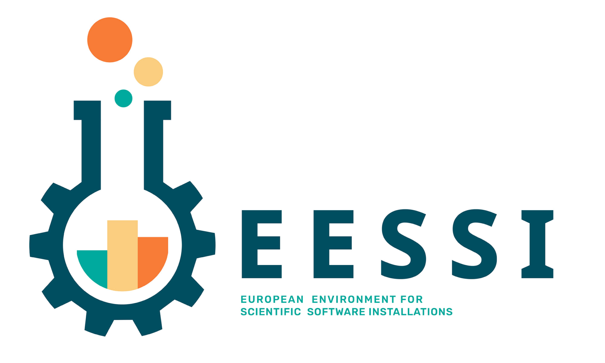

# Integration of EasyBuild in EESSI

<p align="center"></p>

The [**European Environment for Scientific Software Installations** (EESSI)](https://www.eessi-hpc.org) is
a collaborative project, by and for the computational science community, with the main goal being to provide a
**shared central stack of (optimized) scientific software installations** that can be used on a variety of systems,
ranging from personal workstations to HPC system and cloud infrastructure, through supporting different CPUs,
accelerators (such as GPUs), network interconnects, and operating systems.

### High-level overview

In order to achieve this ambitious goal, the project consists of three inter-operating and stacked layers that
each serve a different purpose:

<p align="center"></p>

* The *filesystem layer* is responsible for distributing the software installations provided by EESSI
  repository from centrally managed servers to client systems. This is done by using [CernVM-FS](https://cernvm.cern.ch/fs),
  a read-only, globally distributed filesystem that is optimized for distributing software.
  From the point of view of an end user this results in a transparent experience where software installations are
  downloaded to the client system (and cached there) on-demand, as they are being used.

* The *compatibility layer* provides operating system libraries that are required by the scientific software
  installations. It ensures that the software installations provided by EESSI work on different (versions of) operating
  systems, as it alleviates relying on libraries provided by the operating system of the client. We use
  [Gentoo Prefix](https://wiki.gentoo.org/wiki/Project:Prefix) to build the compatibility layer,
  since it is a Linux distribution that can be built from source in a given path (a 'prefix').

* The *software layer* consists of the actual scientific software installations, which are optimised for different
  types and generations of microprocessors, and are built on top of the compatibility layer. These installations
  were installed with **EasyBuild**, and corresponding environment modules are included so
  [Lmod](https://lmod.readthedocs.io) can be used to easily access the software installations.
  The [archspec](https://github.com/archspec/archspec) Python library is used to auto-detect the CPU microarchitecture
  of the client system so that the best suited subset of software installations can be selected, which typically
  significantly benefits performance.

### Getting access

To get access to EESSI on a client system, it suffices to install [CernVM-FS](https://cernvm.cern.ch/fs) and the
[EESSI configuration package](https://github.com/EESSI/filesystem-layer/releases). For a production-quality setup,
especially when using multiple client systems, [additional configuration of
CernVM-FS](https://cvmfs.readthedocs.io/en/stable/cpt-squid.html) should be done to enjoy the benefits of a multi-level caching hierarchy.

Once CernVM-FS is installed and configured for EESSI, you can prepare your environment for using the software provided
by EESSI, load the modules for the software you need, and start running your workloads:

```
$ source /cvmfs/pilot.eessi-hpc.org/latest/init/bash
[EESSI pilot 2021.12] $ module load GROMACS
[EESSI pilot 2021.12] $ gmx mdrun ...
```

For more information, see the [*Getting Started with EESSI* talk at the 7th EasyBuild User Meeting
(EUM'22)](https://easybuild.io/eum22/#eessi-getting-started).

### Inspiration

The design of the EESSI project is heavily influenced by the [central software stack provided by the Advanced Research Computing (ARC)
component of the Digital Research Alliance of Canada](https://ssl.linklings.net/conferences/pearc/pearc19_program/views/includes/files/pap139s3-file1.pdf),
(formerly Compute Canada), where a similar approach is used to build a shared software stack that can be leveraged on the different Canadian HPC
systems (and beyond). EESSI is significantly more ambitious however, by aiming to support a broader range of
system architectures (incl. Arm, POWER, and eventually also RISC-V CPUs), and by intending to work together with
the broader computational science community in building the shared software stack.

### Use cases

The primary goal of the EESSI project is to provide a software stack of optimized scientific software installations
that can be used on a wide variety of platforms, including HPC clusters, cloud, servers, and laptops.

The EESSI project also intends to go several steps further, by building a test suite to verify the
correctness of the provided software installations and facilitate performance evaluation, and by working together
with the developers of the scientific software that is included in EESSI, with the intent to have the software
installations vetted.

### More information 

* EESSI website: [https://www.eessi-hpc.org](https://www.eessi-hpc.org)
* EESSI @ GitHub: [https://github.com/EESSI](https://github.com/EESSI)
* EESSI documentation: [https://eessi.github.io/docs](https://eessi.github.io/docs)
* recorded talk at EUM'21: [*Introduction to EESSI*](https://easybuild.io/eum21/#eessi)
* recorded talk at EUM'22: [*Getting Started with EESSI*](https://easybuild.io/eum22/#eessi-getting-started)
* paper: [*EESSI: A cross-platform ready-to-use optimised scientific software stack*](https://doi.org/10.1002/spe.3075)

---

[*next: Integration of EasyBuild in LUMI*](integration_lumi.md) - [*(back to overview page)*](index.md)

