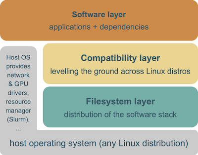

# Integration of EasyBuild in EESSI

The [**European Environment for Scientific Software Installations** (EESSI)](https://www.eessi-hpc.org) is
a collaborative project, by and for the computational science community, with as main goal to provide a
**shared central stack of (optimized) scientific software installations** that can be used on a variety of systems,
ranging from personal workstations to HPC system and cloud infrastructure, through supporting different CPUs,
accelerators (such as GPUs), network interconnects, and operating systems.

In order to achieve this ambitious goal, the project consists of three inter-operating and stacked layers that
each serve a different purpose:

* The *filesystem layer* is responsible for distributing the software installations provided by EESSI
  repository from centrally managed servers to client systems. This is done by using [CernVM-FS](https://cernvm.cern.ch/fs),
  a read-only, globally distributed filesystem that is optimized for distributing software.
  From the point of view of an end user this results in a transparent experience where software installations are
  downloaded to the client system (and cached there) on-demand, as they are being used.

* The *compatibility layer* provides operating system libraries that are required by the scientific software
  installations. It ensures that the software installations provided by EESSI work on different (versions of) operating
  systems, as it alleviates relying on libraries provided by the operating system of the client. We use
  [Gentoo Prefix](https://wiki.gentoo.org/wiki/Project:Prefix) to build the compatibility layer,
  since it is a Linux distribution that can be built from source in a given path (a 'prefix').

* The *software layer* consists of the actual scientific software installations, which are optimised for different
  types and generations of microprocessors, and are built on top of the compatibility layer. These installations
  were installed with **EasyBuild**, and corresponding environment modules are included so
  [Lmod](https://lmod.readthedocs.io) can be used to easily access the software installations.
  The [archspec](https://github.com/archspec/archspec) Python library is used to auto-detect the CPU microarchitecture
  of the client system so that the best suited subset of software installations can be selected, which significantly
  benefits performance.

The design of the EESSI project is heavily influenced by the [Compute Canada software stack](https://ssl.linklings.net/conferences/pearc/pearc19_program/views/includes/files/pap139s3-file1.pdf),
where a similar approach is used to build a shared software stack that can be leveraged on the different Canadian HPC
systems (and beyond). EESSI is significantly more ambitious however, by aiming to support a broader range of
system architectures (incl. Arm, POWER, and eventually also RISC-V CPUs), and by intending to work together with
the broader computational science community in building the shared software stack.

Next to providing a central stack of scientific software installations that can be employed on a wide range of
systems, the EESSI project also intends to go several steps further, by building a test suite to verify the
correctness of the provided software installations and facilitate performance evaluation, and by working together
with the developers of the scientific software that is included in EESSI, with the intent to have the software
installations vetted.

A p

### Links

* EESSI website: [https://www.eessi-hpc.org](https://www.eessi-hpc.org)
* EESSI @ GitHub: [https://github.com/EESSI](https://github.com/EESSI)
* EESSI documentation: [https://eessi.github.io/docs](https://eessi.github.io/docs)
* Introduction to EESSI: [recording](https://www.youtube.com/watch?v=1CXwzIW_MsU&list=PLhnGtSmEGEQh0pCtmkFQsDzeoo6tbYnyZ&index=8), [slides (PDF)](https://easybuild.io/eum21/006_eum21_eessi.pdf)
* Getting Started with EESSI: [recording](https://www.youtube.com/watch?v=sreSIQHTGL8&list=PLhnGtSmEGEQgCneeSQvYoIZrbv7wIKlo2), [slides (PDF)](https://easybuild.io/eum22/012_eum22_getting_started_with_EESSI.pdf)
* [paper: *EESSI: A cross-platform ready-to-use optimised scientific software stack*](https://doi.org/10.1002/spe.3075)

---

[*next: Integration of EasyBuild in LUMI*](integration_lumi.md) - [*(back to overview page)*](index.md)

