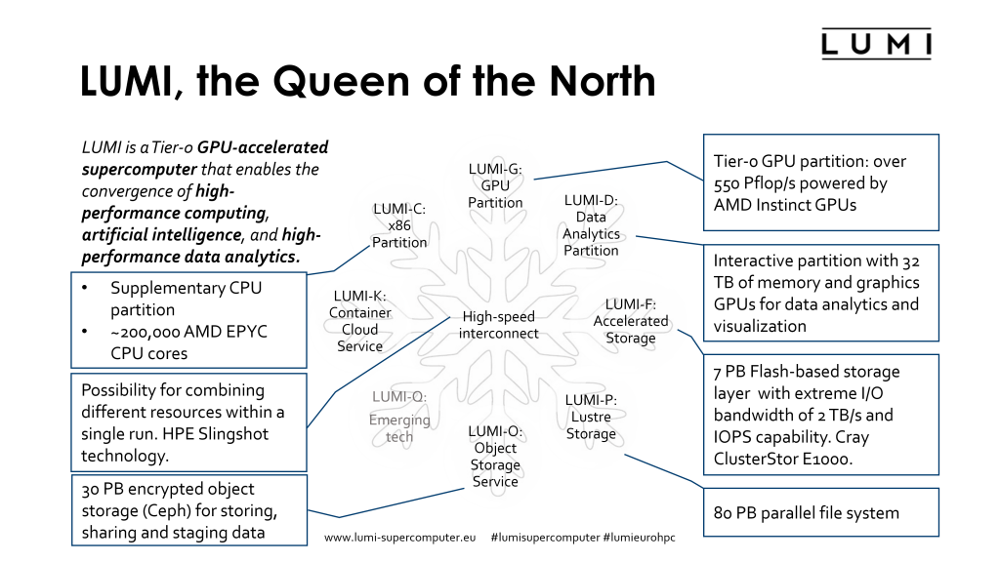

# Integration of EasyBuild in LUMI

## General information

[LUMI](https://www.lumi-supercomputer.eu/), (installed at CSC), is one of the three planned 
[EuroHPC pre-exascale systems](https://eurohpc-ju.europa.eu/discover-eurohpc-ju#ecl-inpage-211) 
meant to be installed in 2022-2022, 
together with Leonardo (installed at Cineca) and MareNostrum5 (installed at BSC).
LUMI, which stands for Large Unified Modern Infrastructure, is hosted by the 
[LUMI consortium](https://www.lumi-supercomputer.eu/lumi-consortium/),
a consortium of 10 countries: Finland, Belgium, Czech Republic, Denmark, Estonia, Iceland, 
Norway, Poland, Sweden, and Switzerland. It was supposed to be installed by the end of 2021,
but the global shortage of components and some technical problems have delayed the installation.
The final hardware should be installed at about the time of this ISC'22 tutorial.

LUMI is a HPE Cray EX supercomputer with several partitions targeted for different use cases.
It is also possible to run heterogeneous jobs across multiple partitions.

-   The main compute power is provided by the LUMI-G GPU compute partition consisting of 2560 nodes.
    The LUMI-G node is a revolutionary compute node in the x86+GPU-world. 
    It is also truly a "GPU first" system.
    Each GPU compute node has a single 64 core AMD EPYC 7A53 "Trento" CPU and 4 MI250X GPUs. 
    Each MI250X package contains two GPU compute dies connected to each other via AMD's InfinityFabric
    interconnect and 8 HBM2e memory stacks, 4 per die. The GPUs and CPU are all connected through
    AMD's InfinityFabric interconnect, creating a system with a cache coherent unified memory space.
    The Trento CPU is a zen3 generation product but with an optimised I/O die that can run the
    InfinityFabric interconnect at a higher speed than standard Milan CPUs.
    Each node also have 4 200Gbit/s SlingShot 11 interconnect cards, each connected directly to 
    a different GPU package. Each node has 512GB HBM2e RAM spread evenly across the GPU dies and 
    512 GB of regular DDR4 DRAM connected to the CPU. The nodes are diskless nodes.
    The (very) theoretical peak performance of a GPU node is
    around 400 Tflops for FP64 vector operations or 800 TFlops for FP64 matrix operations.
-   The main CPU partition, called LUMI-C, consists of 1536 nodes with 2 64-core AMD
    EPYC 7763 CPUs. Most nodes have 256 GB of RAM memory, but there are 128 nodes with
    512 GB of RAM and 32 nodes with 1 TB of RAM. In the final system, each node will be equipped
    with one 200 Gbit/s SlingShot 11 interconnect card. These nodes are diskless nodes.
-   A section mostly meant for interactive data analysis consists of 8 nodes with 2 64-core
    AMD EPYC 7742 CPUs and 4 TB of RAM per node. These nodes are connected to the interconnect
    through 2 100 Gbit/s SlingShot 10 links.
-   The second part of LUMI-D, the data visualisation section, consists of 8 nodes with two 
    64-core AMD EPYC 7742 CPUs and 8 NVIDIA A40 GPUs each. Each node has 2 TB of RAM and is
    connected to the interconnect through 2 100 Gbit/s SlingShot 10 links.
-   LUMI-K will be an OpenShift/Kubernetes container cloud platform for running microservices
    with roughly 50 nodes.
-   LUMI also has an extensive storage system
    -   There is a 7 PB flash-based storage system with 2 TB/s of bandwidth and high IOPS
        capability using the Lustre parallel file system adn Cray ClusterStor E1000 technology.
    -   The main disk based storage contains of 4 20 PB storage systems based on regular hard
        disks and also using the Lustre parallel file system.
    -   A 30 PB Ceph-based encrypted object sotrage system for storing, sharing and staging data
        will become available at a later date.

## Challenges

-   LUMI comes with the HPE Cray Programming Environment (PE) with the Cray Compiling Environment
    (a fully Clang/LLVM-based C/C++ compiler and a Fortran compiler using a Cray frontend but
    LLVM-based backend) and GNU and AMD compilers repackaged by Cray. The HPE Cray PE uses
    an MPICH-based MPI implementation (with libfabric backend on SlingShot 11) and also comes 
    with its own optimised mathematics libraries containing all the usual suspects you expect 
    from an EasyBuild toolchain. The environment is however managed outside EasyBuild, but
    EasyBuild has a mechanism to integrate with it.

    Due to the specific hardware and software setup of LUMI using the EasyBuild common toolchains 
    is all but straightforward. Getting Open MPI, a key component of the foss toolchain, to work 
    is a bit of a challenge at the moment. The Intel compilers are not a very good match with 
    AMD CPUs. One needs to be very careful when choosing the target architecture for code
    optimisation (`-xHost` will not generate AVX/AVX2 code), most recent versions of MKL have
    performance problems and sometimes produce wrong results and some recent MPI versions also
    cause problems with AMD CPUs.

-   LUMI has only a small central support team of 9 FTE. It is obvious that we cannot give the same
    level of support for software installations as some of the big sites such as JSC can do. Moreover,
    due to the nature of the LUMI environment with its Cray PE and novel AMD GPUs, installing software
    is more challenging than on your typical Intel + NVIDIA GPU cluster with NVIDIA/Mellanox
    interconnect. Given that the technology is very new one can also expect a rapid evolution of
    the programming environment with a risk of breaking compatibility with earlier versions,
    and a need for frequent software updates in the initial yeas of operation to work around bugs
    or make new and important features available. So the maintenance cost of a the user application
    stack is certainly higher than on clusters based on more conventional technology. Early experience
    has also shown that we need to be prepared for potentially breaking changes on very short notice.

    It also means that we have to be very agile when it comes to maintaining the software stack and
    that it is also impossible to thoroughly test all installations, so we must be able to make
    corrections quickly. This goes against a big central software stack, as in a central software
    stack it is nearly impossible to replace an installation that fails for some users outside
    maintenance intervals.

-   The central support team may be small (the above 9 FTE), but the 
    LUMI consortium agreement states that the 
    consortium countries also have to assist in providing support. Given that neither the 
    LUMI User Support Team members nor the local support teams are employees of CSC this 
    also means that much of the application support has to be delivered with very little
    rights on the system (at most a working directory that is readable for all users). So we 
    need a setup where it is possible to help users installing applications while having
    only regular user rights on the system.

-   Due to the exploitation model and the small size of the central support team, license management
    is a pain. Users come to LUMI through 11 different channels (some with subchannels). Moreover it
    is the responsibility of the PI to invite users to a project and to ensure that they are eligible
    for LUMI use (taking into account, e.g., the European and USA export restrictions). At the central
    level we have no means currently to check who can use which software license. Hence we need a
    solution to distribute that responsibility also.

-   I personally believe that users really want a customised software stack. They may say they want 
    a central stack but only as long as it contains the software they need and not much more as they 
    also do not want to search through long lists of modules. Nobody is waiting for 20 different
    configurations of a package, but the reality is that different users will want different versions
    with sometimes conflicting configurations, or compiled with different compilers. 

    We also note that some communities forego centrally installed software which may have better
    optimised binaries to build their own custom setup using tools such as Conda. 

    And even though modules go a long way in managing dependencies and helping to avoid conflicts,
    we expect that with the explosion of software used on HPC machines and the poor maintenance of that
    software, it will become increasingly difficult to find versions of dependencies that work for 
    a range of programs, leading to cases where we may simply need to install a software package
    with different sets of dependencies simply because users want to use it together with other 
    packages that have restrictions on the versions of those dependencies. Experienced Python users
    without doubt know what a mess this can create and how even a single user sometimes needs
    different virtual environments with different installations to do their work.

## Solution with EasyBuild and Lmod

On LUMI we selected EasyBuild as our primary software installation tool, but also offer some limited
support for Spack. EasyBuild was selected as there is already a lot of experience with EasyBuild in
several of the LUMI consortium countries and as it is a good fit with the goals of the EuroHPC JU
as they want to establish a European HPC ecosystem with a European technology option at every level.
The developers of EasyBuild are also very accessible and it helps that the lead developer and several
of the maintainers are from LUMI consortium countries.

We use Lmod as the module tool. We basically had the choice between Lmod and the old C implementation
of TCL Environment Modules as HPE Cray does not support the more modern Environment Modules 4 or 5 
developed in France. Support for Lmod is excellent in EasyBuild and Spack, and Lua is also
a more modern language to work with than TCL.

### Software stacks

On LUMI we offer users the choice between multiple software stacks, offered through hand-written
Lmod modules.

-   The *CrayEnv* stack is really just a small layer on top of the HPE Cray PE in which we provide
    a few additional tools and help the user with managing the environment for the HPE Cray PE.

    The HPE Cray PE works with a universal compiler wrapper that sets some optimisation options for
    the supported compilers and sets the flags to compile and link with the MPI, optimised scientific
    libraries and some other libraries provided with the PE. It does so based on which modules are
    loaded. The CPU and GPU targets and the MPI fabric library are selected through so-called
    target modules, typically loaded during shell initialisation, while compiler, MPI and
    scientific libraries are typically loaded through the so-called * PrgEnv*  modules (one for each
    supported compiler). The CrayEnv software stack module will take care of ensuring that a proper
    set of target modules is loaded depending on the node type on which the module is loaded, and 
    hence also reloading the proper target modules after a `module purge`. 

    The environment is also enriched with a number of build tools that are not installed in the OS image
    or only in an older version. These tools are often build with EasyBuild with the `SYSTEM` toolchain
    though we do not make EasyBuild itself available to users in that stack.

-   The *LUMI* stack is a software stack which is mostly managed with EasyBuild. The stack is versioned
    based on the version of the HPE Cray PE which makes it easy to retire a whole stack when the compilers
    are retired from the system. If we need the same software in two different stacks, it is simply compiled
    twice, even if it is only installed with the system compilers, to make retiring software easier without
    having to track dependencies (we now simmply have to remove a few directories to remove a whole
    software stack which will not have an impact on the other stacks). The
    exception are a few packages installed from binaries that are installed in a separate area across
    software stacks (e.g., ARM Forge and Vampir). The LUMI stack provides optimised binaries for each node
    type of LUMI, but some software that is not performance-critical is compiled only once. To this end we 
    have a partition corresponding to each node type, but also a common partition which is included with 
    the software of all other partitions. Software in that common partition can only have dependencies 
    in the common partition though.

    For now we keep the central LUMI software stack very small, but we provide an easy and fully transparent
    mechanism for the user to install software in their project directory that integrates fully with the LUMI
    stack. The user only needs to set an environment variable pointing to the project space.

In the future we envision that more software stacks may become available on LUMI as at least one local support
organisation wants to build their own stack. We also hope in a future collaboration with HPE to find a solution
to get the foss toolchain working on at least the CPU nodes of LUMI with minimal changes.

### EasyBuild for software management

The second component to our solution is EasyBuild. EasyBuild can give a very precise description of
all the steps needed to build a package while the user needs to give very few arguments to the `eb` command
to actually do the installation. It is also robust enough that with a proper module to configure EasyBuild,
an installation done by one user on LUMI will reproduce easily in the environment of another user. 
The fact that each easyconfig file contains a very precise list of dependencies, including versions and
not only the names of the dependencies, is both a curse and a blessing. It is a curse when we need to upgrade
to a new compiler and also want to upgrade versions of certain dependencies, as a lot of easyconfig files need
to be checked and edited. In those cases the automatic concretiser of Spack may help to get running quicker.
But that very precise description is also a blessing when communicating with users as you can  
communicate with them through EasyBuild recipes (and possibly an easystack file, which defines a list of 
easyconfig files to install) rather than having part of the specification in command line options of the
tool. So a user doesn't need to copy long command lines and as a support person
you know exactly what EasyBuild will do, so this leaves less room for errors and difficult to solve support
tickets.

