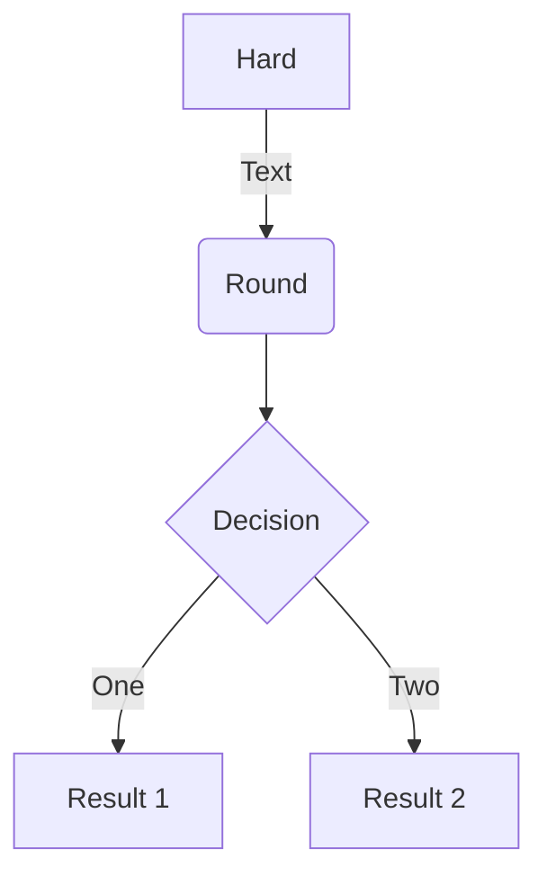

# Adding support for additional software

We already know how to install easyconfig files that are included with EasyBuild,
but what about installing software for which no easyconfig is available yet?

To do this we will need to **create additional easyconfig files**,
since every software installation performed by EasyBuild is done based on an easyconfig file.

In this part of the tutorial we will look at the guts of easyconfig files and even create some ourselves!

## Easyconfigs vs easyblocks

## Writing easyconfig files

```python linenums="1"
name = 'example'
version = '1.2.3'

toolchain = {'name': 'foss', 'version': '2019b'}
```



### Mandatory parameters

#### Software name & version

#### Homepage and description

#### Toolchain

### Commonly used parameters

#### Easyblock

generic vs software-specific

common generic easyblocks

`ConfigureMake`
`CMakeMake`
`PythonPackage`
`PythonBundle`

[https://easybuild.readthedocs.io/en/latest/version-specific/generic_easyblocks.html](https://easybuild.readthedocs.io/en/latest/version-specific/generic_easyblocks.html)

#### Sources

#### Dependencies

#### Version suffix

#### Command options

#### Sanity check

#### Module class

### Custom parameters

`eb -a --easyblock PythonPackage`

## Generating tweaked easyconfigs

`--try-*`

## Copying easyconfigs

`--copy-ec`

## Implementing easyblocks

(out of scope)

## Example

By means of example, we are going to puzzle together an easyconfig file to install the
example software package `eb-tutorial`.

The sources for `eb-tutorial` version 1.0.0 are available at:

```
https://github.com/easybuilders/easybuild-tutorial/raw/master/docs/files/eb-tutorial-1.0.0.tar.gz
```

You can consult the unpacked sources at [https://github.com/easybuilders/easybuild-tutorial/tree/master/docs/files/eb-tutorial-1.0.0](https://github.com/easybuilders/easybuild-tutorial/tree/master/docs/files/eb-tutorial-1.0.0).

### Preparation

Make sure EasyBuild is properly configured before you start:

```shell
export EASYBUILD_PREFIX=$HOME/easybuild
export EASYBUILD_BUILDPATH=/tmp/$USER
```

and that the installed software in `/easybuild` is available:

```shell
module use /easybuild/modules/all
```

### Mandatory easyconfig parameters

Let's start by getting the mandatory easyconfig parameter defined in the easyconfig file:

```python
name = 'eb-tutorial'
version = '1.0.0'

homepage = 'https://easybuilders.github.io/easybuild-tutorial'
description = "EasyBuild tutorial example"

toolchain = {'name': 'GCC', 'version': '9.3.0'}
```

We will use `GCC/9.3.0` as toolchain, since we know it is already installed in `/easybuild` in the prepared environment.

In addition, we'll also specify the `moduleclass`. This is not required, but it is usually set
to a reasonable value:

```python
moduleclass = 'tools'
```

The default value is '`base`', at least '`'tools`' has *some* meaning.

### Easyblock

Let us see what happens if we take this easyconfig file for a spin:

```shell
$ eb eb-tutorial.eb 
== temporary log file in case of crash /tmp/eb-8_vxjfn7/easybuild-k3aaoan2.log
ERROR: Failed to process easyconfig /home/example/eb-tutorial.eb:
No software-specific easyblock 'EB_eb_minus_tutorial' found for eb-tutorial
```

That didn't get us very far...

The error shows that there is no software-specific easyblock available for `eb-tutorial`.
Does that mean we have to implement an easyblock?

In this simple case it doesn't since we can leverage one of the available generic easyblocks.
But, which one? Build instructions are usually shared in the `README` or documentation,
but here were are left to figure things out by ourselves...

When inspecting the [unpacked sources](https://github.com/easybuilders/easybuild-tutorial/tree/master/docs/files/eb-tutorial-1.0.0) we see a `CMakeLists.txt` file.
That probably means the installation will involve running `cmake` to configure
the build, which likely will yield a `Makefile` so we can run `make` afterwards.

We briefly discussed a generic easyblock that does exactly this: `CMakeMake`.

```python
easyblock = 'CMakeMake'
```

The "`easyblock =`" line is usually at the top of the easyconfig file, but strictly speaking
the order of the parameter definitions doesn't matter (unless one is defined the terms of another one).

### CMake build dependency

Does that help at all?

```
$ eb eb-tutorial.eb 
== temporary log file in case of crash /tmp/eb-yutbor1p/easybuild-4jc9v1u9.log
== found valid index for /easybuild/software/EasyBuild/4.2.1/easybuild/easyconfigs, so using it...
== processing EasyBuild easyconfig /home/example/eb-tutorial.eb
== building and installing eb-tutorial/1.0.0-GCC-9.3.0...
== fetching files...
== creating build dir, resetting environment...
== unpacking...
== patching...
== preparing...
== configuring...
== FAILED: Installation ended unsuccessfully (build directory: /tmp/easybuild/ebtutorial/1.0.0/GCC-9.3.0):
build failed (first 300 chars): cmd " cmake -DCMAKE_INSTALL_PREFIX=/home/example/easybuild/software/eb-tutorial/1.0.0-GCC-9.3.0 -DCMAKE_BUILD_TYPE=Release -DCMAKE_C_COMPILER='gcc' -DCMAKE_C_FLAGS='-O2 -ftree-vectorize -march=native -fno-math-errno' -DCMAKE_CXX_COMPILER='g++' -DCMAKE_CXX_FLAGS='-O2 -ftree-vectorize -march=native  (took 0 sec)
```

It did help: EasyBuild made an attempt to configure the build using the `cmake` command, but that failed almost
instantly. We need to dive into the log file to see the actual reason. By starting at the end of the log file and
scrolling up, you should be able to locate the following:

```
/bin/bash: cmake: command not found
```

Ah, that explains it, `cmake` isn't even installed. Now what?

```shell
$ module avail CMake

--------------------------- /easybuild/modules/all ----------------------------
   CMake/3.16.4-GCCcore-9.3.0
```

Since `CMake` is already installed, we can use it as a dependency for the installation.
It is only needed for building the software, not for running it, so it's only a *build* dependency:

```python
builddependencies = [('CMake', '3.16.4')]
```

There is usually no need to specify toolchain for (build) dependencies, EasyBuild will automatically consider
subtoolchains compatible with the specified toolchain to locate module for the dependencies.

You can verify this via `eb -D`:

```
$ eb eb-tutorial.eb -D
 ...
 * [x] /easybuild/software/EasyBuild/4.2.1/easybuild/easyconfigs/c/CMake/CMake-3.16.4-GCCcore-9.3.0.eb (module: CMake/3.16.4-GCCcore-9.3.0)
 * [x] /easybuild/software/EasyBuild/4.2.1/easybuild/easyconfigs/g/GCC/GCC-9.3.0.eb (module: GCC/9.3.0)
 * [ ] /home/example/eb-tutorial.eb (module: eb-tutorial/1.0.0-GCC-9.3.0)
```

### Sources

If you try again after adding `CMake` as a build dependency, you will see the installation fail again in the
configuration step. Inspecting the log file reveals:

```
CMake Error: The source directory "/tmp/example/ebtutorial/1.0.0/GCC-9.3.0" does not appear to contain CMakeLists.txt.
```

Wait, but there *is* a `CMakeLists.txt`, we can see it in the [unpacked sources](https://github.com/easybuilders/easybuild-tutorial/tree/master/docs/files/eb-tutorial-1.0.0)!

Let's inspect the build directory:

```
$ ls /tmp/$USER/ebtutorial/1.0.0/GCC-9.3.0
easybuild_obj
$ ls /tmp/$USER/ebtutorial/1.0.0/GCC-9.3.0/easybuild_obj
$
```

There's nothing there at all! And that's not strange because we didn't actually
specify any sources in our easyconfig file.

The `sources` easyconfig parameter is commonly defined but it is *not* mandatory,
because some easyconfig files only specify bundles of software packages and hence only
serve to generate a module file.

So we need to specify `sources`. We might as well also define `source_urls`, so EasyBuild
can download the sources for us.

```python
source_urls = ['https://github.com/easybuilders/easybuild-tutorial/raw/master/docs/files/']
sources = ['eb-tutorial-1.0.0.tar.gz']
```

This will work, but we can do better by not hardcoding the software version (`1.0.0`) in `sources`,
and use a template value '`%(version)s`' instead:

```python
sources = ['eb-tutorial-%(version)s.tar.gz']
```

That way, we only have the software version specified once in the easyconfig file (via the `version`
easyconfig parameter). That will come in useful later (see <a href="#exercises">Exercise 7.1</a>)...

We can even use the `SOURCE_TAR_GZ` template constant in this case, since the name of source file adhers
to the standard `name-version.tar.gz` pattern:

```python
sources = [SOURCE_TAR_GZ]
```

See the output of "`eb --avail-easyconfig-template`" for a list of known templates.

### Required configure option

With `sources` defined, we can try and again. And yet again we see the configure step fail.
Is this a ruse to make you hate CMake with a passion? Maybe...

Here's what we find in the log file:

```
CMake Error at CMakeLists.txt:7 (message):
  EBTUTORIAL_MSG is not set!
```

Apparently the `eb-tutorial` software has a required configure option. It's almost as if that
was done on purpose, how silly!

Options to the configure command can be specified by the `configopts` easyconfig parameter.
To define the value of a CMake option, we need to use `-DNAME_OF_OPTION`, so:

```python
configopts = '-DEBTUTORIAL_MSG="Hello from the online EasyBuild tutorial!" '
```

We need to be a little bit careful with quotes here. If we use outer single quotes,
we have to use double quotes to specify the actual value for the `EBTUTORIAL_MSG` configure option.

Here we can also use outer double quotes and inner single quotes, but that's not always the case!
Sometimes we want environment variables to get expanded when the command is run, so then we should *not* wrap
the actual value in single quotes (so we should use outer single quotes, like we did here).

Think about how you would use a message that includes your username via `$USER` for example...

### Sanity check

Hopefully that brings us closer to getting the installation to work...

```
$ eb eb-tutorial.eb
....
== sanity checking...
== FAILED: Installation ended unsuccessfully (build directory: /tmp/easybuild/ebtutorial/1.0.0/GCC-9.3.0): build failed (first 300 chars):
Sanity check failed: no (non-empty) directory found at 'lib' or 'lib64' in /home/easybuild/easybuild/software/eb-tutorial/1.0.0-GCC-9.3.0 (took 2 sec)
```

It got all the way to the sanity check step, yaay!

But the sanity check failed because no '`lib`' or `'lib64'` directory was found.
Indeed:

```
$ ls $HOME/easybuild/software/eb-tutorial/1.0.0-GCC-9.3.0
bin
$ ls $HOME/easybuild/software/eb-tutorial/1.0.0-GCC-9.3.0/bin
eb-tutorial
```

There is only a binary named `eb-tutorial` in the `bin` subdirectory. So we will need to customize
the sanity check:

```python
sanity_check_paths = {
    'files': ['bin/eb-tutorial'],
    'dirs': [],
}
```

Since we want to obtain a *working* installation, we might as well try to run this `eb-tutorial` command as well:

```python
sanity_check_commands = ['eb-tutorial']
```

Let us now retry, but use `--module-only` rather than redoing the whole installation.
And by enabling trace module via `--trace` we can get some more information too:

```shell
eb eb-tutorial.eb --module-only --trace
...
== sanity checking...
  >> file 'bin/eb-tutorial' found: OK
  >> running command 'eb-tutorial' ...
  >> result for command 'eb-tutorial': OK
...
== COMPLETED: Installation ended successfully (took 4 sec)
```

Yes, great success!

To convince yourself that the installation works as intended, try to load the `eb-tutorial` module and
run the `eb-tutorial` command yourself:

```
$ module load eb-tutorial
$ eb-tutorial
Hello from the online EasyBuild tutorial!
```

### Complete easyconfig

Here is the complete easyconfig we puzzled together for this example:

```python
easyblock = 'CMakeMake'

name = 'eb-tutorial'
version = '1.0.0'

homepage = 'https://easybuilders.github.io/easybuild-tutorial'
description = "EasyBuild tutorial example"

source_urls = ['https://github.com/easybuilders/easybuild-tutorial/raw/master/docs/files/']
sources = [SOURCE_TAR_GZ]
checksums = ['87643c9a950d02471fc283b31e8a088da7d5d49bc9e1bebd5c83b52c2e23b4d8']

toolchain = {'name': 'GCC', 'version': '9.3.0'}

builddependencies = [('CMake', '3.16.4')]

configopts = '-DEBTUTORIAL_MSG="Hello from the online EasyBuild tutorial!" '

sanity_check_paths = {
    'files': ['bin/eb-tutorial'],
    'dirs': [],
}

sanity_check_commands = ['eb-tutorial']

moduleclass = 'tools'
```

---

## Exercises

***Exercise 7.1**** - Installing eb-tutorial version 1.1.0*

Install version 1.1.0 of the `eb-tutorial` example software,
which is a trivial version bump compared to version 1.0.0.

The sources are available via:

```
https://github.com/easybuilders/easybuild-tutorial/raw/master/docs/files/py-eb-tutorial-1.1.0.tar.gz
```

You can leverage the `eb-tutorial` easyconfig file we have composed in the example above,
**but you should not make any manual changes to it!**

??? success "(click to show solution)"
    You can use the `--try-software-version` option for this:
    ```shell
    $ eb eb-tutorial.eb --try-software-version 1.1.0
    ...
    == building and installing eb-tutorial/1.1.0-GCC-9.3.0...
    ...
    == COMPLETED: Installation ended successfully (took 4 sec)
    ```
    To test:
    ```
    $ module use $HOME/easybuild/modules/all
    $ module load eb-tutorial/1.1.0-GCC-9.3.0
    $ eb-tutorial
    I have a message for you:
    Hello from the online EasyBuild tutorial!
    ```
    (`eb-tutorial` version 1.0.0 doesn't print "`I have a message for you:`")

---

***Exercise 7.2**** - Installing py-eb-tutorial 1.0.0*

Try composing an easyconfig file for the `py-eb-tutorial` example software, which is a tiny Python package.
The source tarball can be downloaded from this link: [py-eb-tutorial-1.0.0.tar.gz](https://github.com/easybuilders/easybuild-tutorial/raw/master/docs/files/py-eb-tutorial-1.0.0.tar.gz).

A couple of tips:

* There is a generic easyblock available for installing Python packages, which will come in useful here.

* By default EasyBuild performs an `import` check when install Python packages, using a Python module name that is derived from the software name by default, which will be incorrect in this case. You can specify the correct name to use in the import check by specifying it via the `options`
easyconfig parameter in your easyconfig file:
  ```python
  options = {'modulename': 'example'}
  ```
  (you will need to change '`example`' here, of course)

* Leverage the software that is already pre-installed in `/easybuild` in the prepared environment.
  Remember that some already installed modules may be a *bundle* of a couple of other software packages.

Please also take this into account:

* Unfortunately this software doesn't come with documentation. That is done to make it an example that
  is representative for software that you may run into in the wild (it's *not* because
  we were lazy when preparing the exercises, really!).
  You can inspect the sources of this software [here](https://github.com/easybuilders/easybuild-tutorial/tree/master/docs/files/py-eb-tutorial-1.0.0). Definitely take a look at the `setup.py` file, it includes some clues
  about the requirements to get this software installed.

* Make sure the installation actually *works*, by checking that the `py-eb-tutorial` command runs correctly.
  Maybe you will need to make sure other required software is available as well, for it to work correctly...


??? success "(click to show solution)"

    Here is a complete working easyconfig file for `py-eb-tutorial`:
    ```python

    easyblock = 'PythonPackage'

    name = 'py-eb-tutorial'
    version = '1.0.0'
    versionsuffix = '-Python-%(pyver)s'

    homepage = 'https://easybuilders.github.io/easybuild-tutorial'
    description = "EasyBuild tutorial Python example"

    source_urls = ['https://github.com/easybuilders/easybuild-tutorial/raw/master/docs/files/']
    sources = [SOURCE_TAR_GZ]
    checksums = ['fcf73a9efc65527a210b993e8889d41ebf05977eef1f6a65ebac3188152cd496']

    toolchain = {'name': 'foss', 'version': '2020a'}

    dependencies = [
        ('Python', '3.8.2'),
        ('SciPy-bundle', '2020.03', versionsuffix),
        ('eb-tutorial', '1.0.0'),
    ]

    use_pip = True

    options = {'modulename': 'eb_tutorial'}

    sanity_check_paths = {
        'files': ['bin/py-eb-tutorial'],
        'dirs': ['lib/python%(pyshortver)s/site-packages'],
    }

    sanity_check_commands = ["py-eb-tutorial"]

    moduleclass = 'tools'
    ```

    Some remarks:

    * We used the `PythonPackage` generic easyblock. There is also a `PythonBundle` easyblock for installing
      bundles of Python packages, which is used for `SciPy-bundle` for example. But we don't need that here,
      since we are only dealing with a single Python package.

    * The `versionsuffix` is not strictly needed, but it's common to tag Python packages with the Python version
      for which they were installed. Even though Python 2 is officially dead and buried, some scientific software
      still requires it, and mixing modules where some use Python 2 and other use Python 3 doesn't work well. The
      versionsuffix is helpful to inform the user that a particular Python version is required by the installation.

    * The SHA256 checksum for the source tarball was added automatically via `eb py-eb-tutorial.eb --inject-checksums`.

    * `py-eb-tutorial` only wants to be installed with `pip install`, so we had to set `use_pip = True`.
      You can consult the custom easyconfig parameters supported by the `PythonPackage` easyblock via
      "`eb -a -e PythonPackage`", see the `EASYBLOCK-SPECIFIC` part of the output.

    * By default EasyBuild will try to import `py_eb_tutorial`, while the actual name of the Python package
      provided by `py-eb-tutorial` is just `eb_tutorial`. We fixed this by specifying the correct Python module name to
      use via `options`.

    * Strictly speaking we don't need to specify a custom `sanity_check_paths`, since the default used
      by Python package is already pretty decent (it will check for a non-empty `lib/python3.8/site-packages`
      directory in the installation). We also want to make sure the `py-eb-tutorial` command is available in
      the `bin` subdirectory however. Hardcoding to `python3.8` can be avoided using the `%(pyshortver)s`
      template value.

    * A good way to check whether the `py-eb-tutorial` command works correctly is by running it as a sanity check
      command. If the `eb-tutorial` dependency is not included as a dependency the sanity check will fail,
      since the `py-eb-tutorial` command basically just runs the `eb-tutorial` command.

