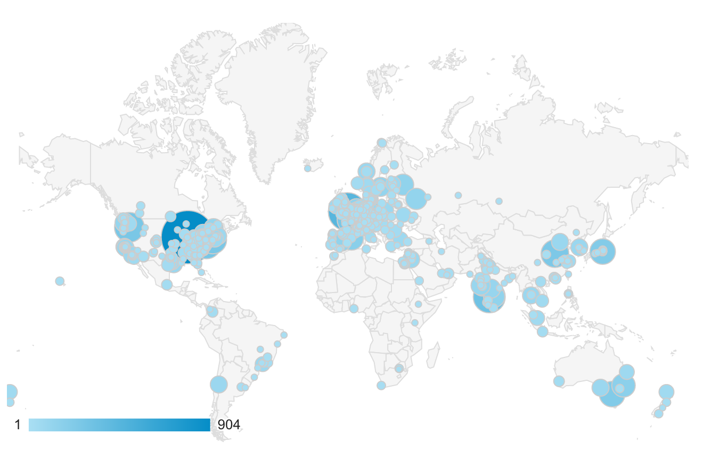

# The EasyBuild community

## The early years

EasyBuild as a project was conceived in 2009 by the [HPC team at Ghent University (Belgium)](https://www.ugent.be/hpc/en).
The codebase was developed in-house, and went through a couple of redesigns as
the team gradually learned the ropes of developing a sizeable software project
and tried to tackle the never-ending corner cases of the installation procedures of scientific software.
During these very early days, several summer interns were invaluable in their assistance
in refining EasyBuild.

As the project grew and its usefulness became apparent, the HPC-UGent team begun to desire feedback from
the HPC community at large. Maybe others would find EasyBuild useful? Or maybe
this was actually a solved problem, and they were unknowingly reinventing the wheel...

The first step in this process
was to pick a license. As many an in-house project, EasyBuild at the time lacked such formalities. This led to
a short debate on open source licenses before the team landed on GPLv2. And no, commercial licenses never even made
it to the table. Like so many open source projects, the goal was simple enough; scratch HPC-UGent's own itch 
and get some outside feedback to help in getting it done!

The first public release of EasyBuild became available in April 2012 and was tagged as version 0.5. This public
release took place mostly out of necessity as the project was about to be
[presented at the HEPIX Spring Workshop 2012](https://indico.cern.ch/event/160737/contributions/1407847/).
Based on early feedback, the EasyBuild team realised others would indeed find EasyBuild useful, so efforts were made to
produce a stable version to ensure that others could rely on the project if they wanted to.

([EasyBuild v1.0](https://pypi.org/project/easybuild/1.0.0)) was released in November 2012, barely seven months after
version 0.5 was published. This first stable release coincided with the
[SC'12 conference in Salt Lake City](http://sc12.supercomputing.org/), where the team handed out stickers and went
around asking how everyone else installed scientific software. There was never much of a sales pitch, but the
conversations very quickly took on a rather predictable script...

> EasyBuild team member: *How do you install scientific software?*

> HPC staff: *We do it manually, and spend a lot of time on it.*  

> EasyBuild team member: *What if there was a tool that could help?*

> HPC staff: *Nobody in their right mind would develop a tool like that. That's madness.*

> EasyBuild team member: *What if we have a tool like this that you could use?*

> HPC staff: *What does it cost?*  

> EasyBuild team member: *It's open source. It's free.*

> HPC staff: *... Yeah, cool. What about the hard stuff? When will you support OpenFOAM?*  

> EasyBuild team member: *We already do. And we support WRF too.*

And then suddenly everyone was a friend. Beers and snacks started appearing out of nowhere
and all the stickers disappeared. Once the beers and snacks had been "processed", EasyBuild
took its place on the presentation floor. At SC'12, EasyBuild's stage was the
[PyHPC 2012 workshop](http://sc12.supercomputing.org/schedule/event_detail.php-evid=wksp118.html).

Following the public release and the projects introduction into the HPC community,
other sites started to use EasyBuild and actively contribute to the project. As odd as it might sound, this
was quite unexpected. The EasyBuild team was hoping for feedback. Receiving contributions was a big surprising bonus. 
Early adopters were the [University of Luxembourg](https://hpc.uni.lu), the [Cyprus Institute](https://www.cyi.ac.cy/),
the [University of Basel](https://scicore.unibas.ch/), and the [Jülich
Supercomputing Centre](https://www.fz-juelich.de/ias/jsc).

## A worldwide community

Over the years EasyBuild has grown into a **community project**,
which is used and developed by dozens (hundreds?) of HPC centres and consortia worldwide. Starting in 2016,
the community has gathered for a yearly EasyBuild User Meeting which typically takes place a week before
or after [FOSDEM](https://fosdem.org). The EasyBuild User Meeting is an open and highly interactive event
that provides a great opportunity to meet fellow EasyBuild enthusiasts, discuss related topics, learn about new aspects of the tool, and how other HPC sites leverage it and integrate it with other tools like [Jenkins](https://www.youtube.com/watch?v=bzW45cfRUMU), [Ansible](https://www.youtube.com/watch?v=Qr2udsAjkG0), [CernVM-FS](https://www.youtube.com/watch?v=_0j5Shuf2uE), [ReFrame](https://www.youtube.com/watch?v=KN9QwQIrso4) etc.

The map below shows from which
cities the [EasyBuild documentation](https://easybuild.readthedocs.io) has
been visited in the last year (June 2019 - June 2020), and how often. The community has truly become global.

HPC sites, consortia, and companies that use EasyBuild include (but are not limited to):

## Development

The EasyBuild community develops the project through the [*easybuilders* GitHub organisation](https://github.com/easybuilders) as set of repositories:

* [easybuild-framework](https://github.com/easybuilders/easybuild-framework) (EasyBuild framework codebase)
* [easybuild-easyblocks](https://github.com/easybuilders/easybuild-easyblocks) (collection of easyblocks)
* [easybuild-easyconfigs](https://github.com/easybuilders/easybuild-easyconfigs) (collection of easyconfigs)
* [easybuild](https://github.com/easybuilders/easybuild) (documentation)
* [easybuild-tutorial](https://github.com/easybuilders/easybuild-tutorial) (this tutorial)

## Maintainers

EasyBuild is [maintained](https://easybuild.readthedocs.io/en/latest/Maintainers.html) by an experienced team of HPC experts, including people from:

* [Ghent University](https://ugent.be/hpc) (Belgium)
* [Vrije Universiteit Brussel](https://hpc.vub.be/) (Belgium)
* [Compute Canada](https://www.computecanada.ca/home/)
* [Jülich Supercomputing Centre](http://www.fz-juelich.de/ias/jsc/EN) (Germany)
* [SURF](https://www.surf.nl/en/research-ict) (Netherlands)
* [National University of Singapore](https://nusit.nus.edu.sg/hpc)
* [Chalmers University of Technology](https://www.chalmers.se/en) (Sweden)
* [Umeå University](http://www.umu.se/english/) (Sweden)
* [sciCORE at the University of Basel](https://scicore.unibas.ch/) (Switzerland)
* [Swiss Data Science Center](https://datascience.ch/)
* [Big Data Institute Oxford](https://www.bdi.ox.ac.uk/) (UK)

The EasyBuild maintainers implement additional features and bug fixes, review and test incoming contributions, and frequently release new stable versions.
