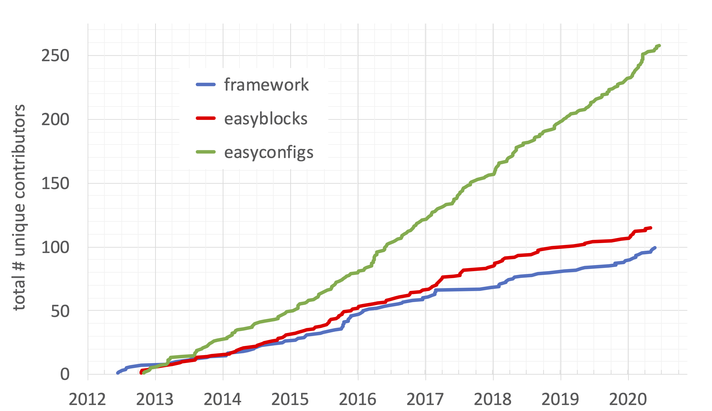
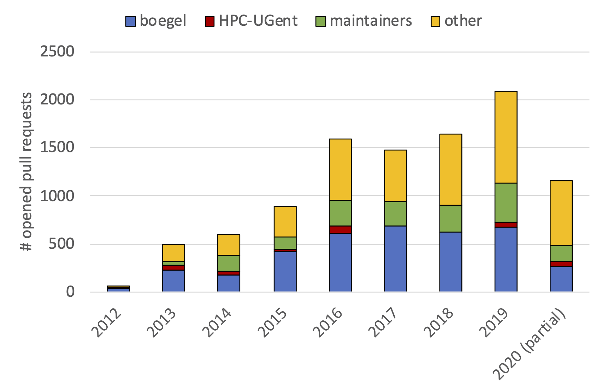

# Contributing to EasyBuild

## Contribution workflow

## Github integration features

### Creating pull requests

`--new-pr`

`--preview-pr`

`--new-github-branch`
`--new-pr-from-branch`

### Updating pull requests

`--update-pr`

`--update-branch`

### Using a pull request

`--from-pr`

`--robot`

`--include-easyblocks-from-pr`

Note: we link to this section from the "Basic usage" part!

### Additional features

`--review-pr`, `--merge-pr`

## Contribution stats

### Unique contributors

### Pull requests per year (easyconfigs)

Almost 2,100 PRs to `easybuild-easyconfigs` repository in 2019, over 2,600 PRs in total across all repositories.

65% of all PRs to `easybuild-easyconfigs` were made by contributors outside of HPC-UGent team in 2019.

