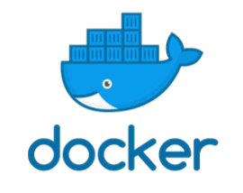

# Practical information

Contact points, resources, helpful hints, and things to keep in mind for the EasyBuild tutorial.


### Slack


There is a dedicated `#tutorial` channel in the EasyBuild Slack where you can get in touch with 
organisers of the tutorial, other participants, and volunteers. Please use this channel to ask
questions throughout the tutorial, or for any other assistance related to the tutorial.

To access this channel, you will first need to create an account in the EasyBuild Slack.
This is done via [https://easybuild-slack.herokuapp.com/](https://easybuild-slack.herokuapp.com/).

Once you have the account set up, you can join the EasyBuild Slack via [https://easybuild.slack.com/](https://easybuild.slack.com/). From there you can join the `#tutorial` channel.
For more information about Slack, please see the official [documentation](https://slack.com/intl/en-no/help/categories/200111606-Using-Slack).


### AWS resources

*(only available during the tutorial on Tuesday June 23rd 2020)*

Access to a shell environment on [AWS Cloud9](https://aws.amazon.com/cloud9/) is provided
for this tutorial.

You should have received an email with connection information if you have registered in time for this tutorial.

***If you did not register and would still like to use AWS Cloud9 for this tutorial, or you have not received
the email with the connection information, please contact the tutorial organisers via Slack.***


### Prepared container image

For the purpose of this tutorial, we have prepared a **Docker container**
that you can use to follow the hands-on exercises in a controlled environment.

This container image includes a small software stack that was installed using
EasyBuild, which will come in useful for the exercises.

The container is available through the [`easybuilders/tutorial` repository on Docker Hub](https://hub.docker.com/r/easybuilders/tutorial), and can be used with both Docker and Singularity.

Make sure you use the container image tagged with "`isc20`".

!!! Note
    **The command you should use to run the container can be copy-pasted below.**

#### Requirements for using the container images

*(only relevant if you are* ***not*** *using AWS Cloud9)*

* having Docker or Singularity installed
* a system with a processor supporting the [AVX instruction set](https://en.wikipedia.org/wiki/Advanced_Vector_Extensions). AVX is supported by Intel Sandy Bridge or AMD Bulldozer (both released in 2011) and onwards.

If you are in doubt about your systems compatibility, see [Testing host compatibility](#testing-host-compatibility) at the end of this document.

#### Container size

The compressed container image is about 1.25GB in size,
and will be downloaded automatically from Docker Hub when you run the `docker` or `singularity` command shown below.

#### Using Docker



If you want to use the prepared container image via Docker,
run the following `docker` command:

```
mkdir -p isc20_easybuild_tutorial
docker run -ti --rm --mount type=bind,source=$PWD/isc20_easybuild_tutorial,target=/home/easybuild --hostname tutorial easybuilders/tutorial:isc20
```

Note that we are bind mounting the `isc20_easybuild_tutorial` directory
into the container as home directory (`/home/easybuild`). That way you can easily
access the files you create when using the container outside of it as well,
for example to edit them. In addition, it allows you to restart the container
without losing the contents of your home directory.

***Output***

When running the "`docker run`" command shown above, you should see output like is shown below
showing that the different layers are being downloaded.

**Take into account that it will take a while for the container image to be downloaded.**

```
Unable to find image 'easybuilders/tutorial:isc20' locally
isc20: Pulling from easybuilders/tutorial
9b4ebb48de8d: Pull complete
f1933cd5add8: Downloading  73.48MB/125.9MB
7bd84e6bca4a: Download complete 
0a4ea0f4d48f: Download complete 
503478215221: Download complete 
c92d5dd0b39f: Download complete 
f968b6fd8043: Download complete 
5bf43b832c15: Download complete 
0545f7354a51: Downloading  30.56MB/534.8MB
d1a244ce82da: Waiting 
c14d5fe9b1e6: Waiting 
b93ec9ec5f20: Waiting
239fd4ac6c1a: Waiting 
9f7279164d6c: Waiting 
8ee47766d1ab: Waiting
```

followed by:

```
...
8ee47766d1ab: Pull complete 
Digest: sha256:25edb356623dde212b256ef23ae17d2b1dc68921094a9c752eac460c78ba9b4c
Status: Downloaded newer image for easybuilders/tutorial:isc20
```

After this, you should see the [welcome message](#welcome-message).

***Docker and cgroups v2***

If you are using a recent Linux distribution that has switched to cgroups v2
 (e.g. [Fedora >= 31](https://www.redhat.com/sysadmin/fedora-31-control-group-v2)), docker will fail with

```
OCI runtime create failed: this version of runc doesn't work on cgroups v2
```

since it is not yet compatible with cgroups v2. Possible workarounds include:

* reverting to cgroups v1 (it can be done via the kernel command-line argument `systemd.unified_cgroup_hierarchy=0`);
* using [Podman](https://podman.io/) instead, which implements the docker CLI;
* using Singularity instead (see below);

#### Using Singularity

*(not available in AWS environment)*


To use the prepared container image via Singularity,
run the following `singularity` command:

```shell
mkdir -p isc20_easybuild_tutorial
singularity run --cleanenv --home $PWD/isc20_easybuild_tutorial docker://easybuilders/tutorial:isc20
```

The additional options are required to:

* `--cleanenv`: start with clean environment
* `--home $PWD/isc20_easybuild_tutorial`: use the `isc20_easybuild_tutorial` subdirectory in the current working directory as home directory in the container

This is mainly to avoid that anything from the host environment or your home directory "leaks" into
the container, which could interfere with the hands-on exercises.

***Limitation: `/easybuild` is read-only***

When the Docker container image is being run with Singularity,
the `/easybuild` directory is read-only in the container.

This creates problems for the demo and exercise in the [Hierarchical module naming schemes](../hmns) part of the tutorial, because EasyBuild still requires write
access to `/easybuild/software` even when generating module files in a different
location outside of `/easybuild`.

***Output***

When running the "`singularity run`" command shown above, you should see output like is shown below.

**Take into account that it will take a while for the container image to be downloaded.**

```
INFO:    Converting OCI blobs to SIF format
INFO:    Starting build...
Getting image source signatures
Copying blob 9b4ebb48de8d done
Copying blob f1933cd5add8 done
Copying blob 7bd84e6bca4a done
Copying blob 0a4ea0f4d48f done
Copying blob 503478215221 done
Copying blob c92d5dd0b39f done
Copying blob f968b6fd8043 done
Copying blob 5bf43b832c15 done
Copying blob 0545f7354a51 done
Copying blob d1a244ce82da done
Copying blob c14d5fe9b1e6 done
Copying blob b93ec9ec5f20 done
Copying blob 239fd4ac6c1a done
Copying blob 9f7279164d6c done
Copying blob 8ee47766d1ab done
Copying config 717b13fece done
Writing manifest to image destination
Storing signatures
...
INFO:    Creating SIF file...
```

After this, you should see the [welcome message](#welcome-message).

***Singularity cache***

By default Singularity keeps its cache at `$HOME/.singularity/cache`.
Since the uncompressed container image requires about 2.2GB of disk space,
make sure this will work in your setup.

If your home directory is limited in size you can either make `$HOME/.singularity` a symbolic link to
`/tmp/$USER/singularity` or a similar spacious volume, or define the `$SINGULARITY_CACHEDIR` environment variable
to make Singulartiy use a different location:

```shell
export SINGULARITY_CACHEDIR=/tmp/$USER/singularity
```

***Warning messages***

When running the Docker container with Singularity, you may see a bunch of warning messages like
this pass by:

```
warn rootless{path/to/file} ignoring (usually) harmless EPERM on setxattr "user.rootlesscontainers"
```

**You can safely ignore these warnings, they are harmless.**
They occur because the Docker container image contains xattrs that can not be set when the container
is extracted as an unpriviledged user by Singularity.
The warnings are generated by the [umoci](https://umo.ci/) library that Singularity uses to extract Docker/OCI layers,
and is documented at [https://umo.ci/quick-start/rootless/](https://umo.ci/quick-start/rootless/).

#### Welcome message

If you are correctly logged in to the container, you should see a message like this:

```
You are logged in to the prepared environment for the introductory tutorial to
 ______                    ____          _  _      _
|  ____|                  |  _ \        (_)| |    | |
| |__    __ _  ___  _   _ | |_) | _   _  _ | |  __| |
|  __|  / _` |/ __|| | | ||  _ < | | | || || | / _` |
| |____| (_| |\__ \| |_| || |_) || |_| || || || (_| |
|______|\__,_||___/ \__, ||____/  \__,_||_||_| \__,_|
                     __/ |
                    |___/

The tutorial materials are available at https://easybuilders.github.io/easybuild-tutorial .

OS: CentOS Linux release 7.8.2003 (Core)
modules tool: Lmod 8.2.7

To access the pre-installed software run 'module use /easybuild/modules/all',
and then check which modules are installed using 'module avail'.

In case of questions or problems contact the tutorial organisers via the #tutorial
channel in the EasyBuild Slack, join via https://easybuild-slack.herokuapp.com .
```

#### Testing host compatibility

To leverage the pre-installed software stack that is included in the container image,
the processor in your system must be compatible with binaries that use AVX instructions
(Intel Sandy Bridge generation, or newer).

You can test the compatibility of your host with the following commands:

```shell
module use /easybuild/modules/all
module load Python
python -V
```

If the last command prints a Python version (like `Python 3.8.2`), then your host is compatible.

If you see a message like "`Illegal instruction (core dumped)`", the processor in your system is *not* compatible
with the pre-installed software stack, and you will have to use another system to participate in the tutorial.

After running this test, you should reset your environment by running "`module purge`", since most of the
exercises assume you are starting from a clean environment.
